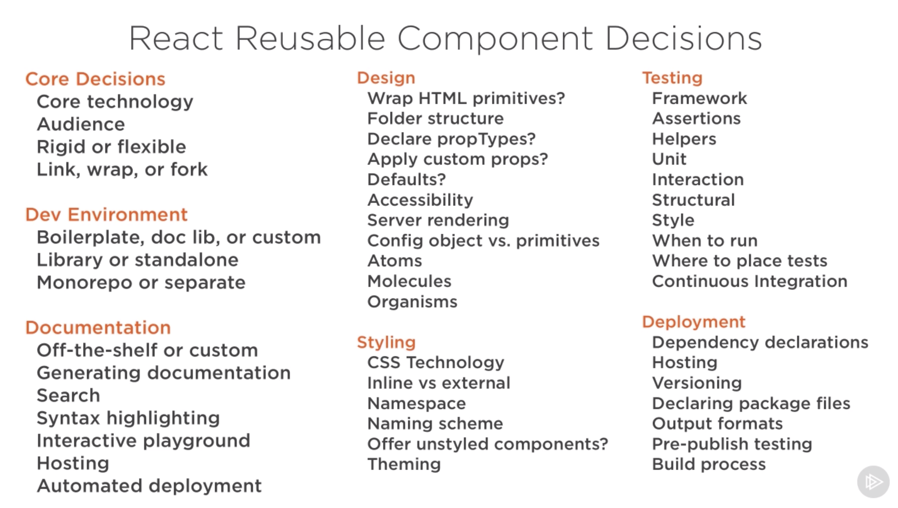
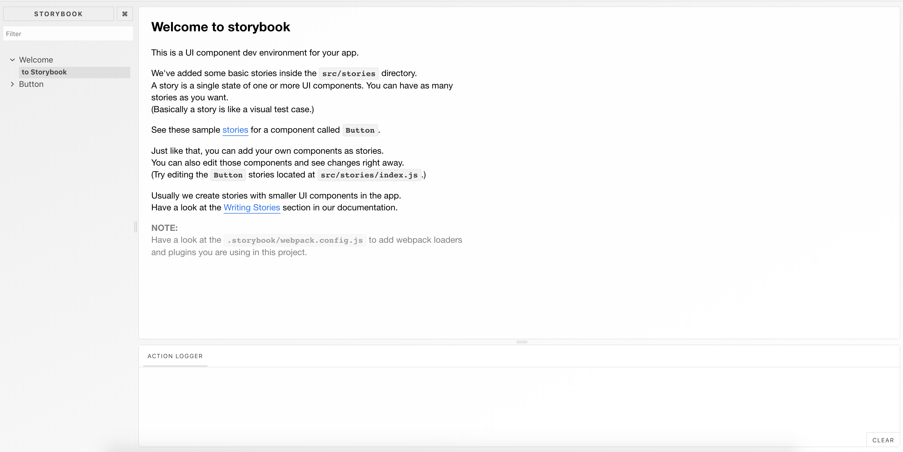

<div id="img-container">

<div class="src-container"><span class="source"><i>source: https://storybookjs.org</i></span></div>
</div>

One of the most valuable tools in component-based design is a self-documenting repository that's generic enough for use across multiple projects. <a href="https://en.wikipedia.org/wiki/Don%27t_repeat_yourself" target="_blank">_DRY_</a>, as the cool kids say.

Since the last few component libraries I've built have been home-rolled, I lurked Reddit, blogs, and GitHub recently to see what the open-source community had to offer for launching one quickly.

After vetting a few candidates, I chose <a href="https://storybookjs.org" target="_blank">Storybook</a> as my sandbox.

Why, you ask? First, it gives me a sensible layout, presentable look, and showcase of features -- saving hours of work as a result. It's also trusted by companies like Airbnb, Coursera, and Slack, so I know it's battle-tested.

After a few days of experimenting, I was able to get the hang of the "Storybook way" of documenting my components and ship an online reference for future projects ✨.

### Getting Started

An important caveat I've encountered when crafting a component library comes from Cory House's <a href="https://www.pluralsight.com/courses/react-creating-reusable-components" target="_blank">PluralSight course</a> (paywall). In it, he describes the numerous decisions one makes when implementing a component library. Some of them include:

- To which (if any) design system will the component styles/UX adhere?
- CSS-in-JS or stylesheets?
- Which build types will be shipped (UMD, AMD, ESModules, etc)?
- Should the developer be allowed to override styles?

The full list is even more daunting:

<div id="img-container">

</div>

So, when prepping for this experiment, I clearly had a few choices to make.

First, the design framework. I chose a <a href="https://www.awwwards.com/brutalism-brutalist-websites.html" target="_blank">Brutalist design system</a> for three reasons:

<ol>
<li>The style essentialy submits full creative license to the designer</li>
<li>An MVP would be relatively quick since the elements found on most Brutalist-inspired sites are notably straightforward *</li>
<li>I like the way it looks <i>(It's a palate cleanser of sorts)</i></li>
</ol>

\* _In fact, the very act of building a component library for Brutalist design defeats the purpose. That said, I'm implementing barebones components that most immediately resemble the style. Plus, I suck at naming things_ 🤦‍♂️.

I also chose <a href="https://emotion.sh/" target="_blank">Emotion</a> for my styling library. I've used it in a few projects and admire its versatility.

Phew. With a few key decisions made, it's time to start coding.

If you want to skip the walkthrough, the finished project is hosted <a href="https://react-brutalist-ui.sh" target="_blank">here</a>. Check out the <a href="https://github.com/alephnode/react-brutalist-ui" target="_blank">source code on GitHub</a> while you're at it.

_Note: This article assumes a basic understanding of React, Node, and Yarn workflows. Refer to their respective documentation/getting started guides if you need a refresher before continuing._

### Initializing the Project

For reference, the finished repo tree will look like this:

```
.
├── README.md
├── package.json
├── src
│   ├── components
│   │   ├── Button
│   │   │   ├── index.js
│   │   │   └── styles.js
│   │   ├── Container
│   │   │   ├── index.js
│   │   │   └── styles.js
│   │   ├── Graph
│   │   │   ├── index.js
│   │   │   └── styles.js
│   │   ├── Headline
│   │   │   ├── index.js
│   │   │   └── styles.js
│   │   ├── Input
│   │   │   ├── index.js
│   │   │   └── styles.js
│   │   ├── Login
│   │   │   ├── index.js
│   │   │   └── styles.js
│   │   └── Marquee
│   │       ├── index.js
│   │       └── styles.js
│   ├── global.css
│   ├── stories
│   │   ├── All.stories.js
│   │   ├── Button.stories.js
│   │   ├── Container.stories.js
│   │   ├── Graph.stories.js
│   │   ├── Headline.stories.js
│   │   ├── Input.stories.js
│   │   ├── Login.stories.js
│   │   ├── Marquee.stories.js
│   │   └── index.stories.js
│   └── theming
│       ├── colors.js
│       ├── layouts.js
│       └── type.js
├── static
│   └── favicon.ico
└── yarn.lock
```

To start, I navigate to the project directory and create a _package.json_ file.

_package.json:_

```javascript
{
  "name": "react-brutalist-ui",
  "version": "0.0.1",
  "main": "index.js",
  "license": "MIT",
  "dependencies": {
    "emotion": "^10.0.6",
    "prop-types": "^15.6.2",
    "react": "^16.8.0-alpha.1",
    "react-dom": "^16.8.0-alpha.1",
    "react-emotion": "^10.0.0"
  },
  "devDependencies": {
    "@babel/core": "^7.2.2",
    "babel-loader": "^8.0.5",
  },
  "scripts": {
    "deploy": "now ./build",
  }
}
```

Next, I initialize Storybook using their cli. (I'm using npx so I don't have to install globally):

```bash
λ npx -p @storybook/cli sb init
```

_Note: if you try to initialize Storybook before creating a package.json file, it'll spit an ugly error._

Storybook should detect that we're using React and initialize a bare proect for us. It'll add some scripts to your _package.json_ file, as well as a _.storybook_ directory with a few configs.

When the command is finished executing, you can test that everything works by running:

```bash
λ yarn storybook
```

You should see a basic template with an example button component, like so:



<br/>

By default, Storybook looks for _\*.stories.js_ files in a _stories_ directory in the root of your project. If you'd like to change this location (mine lives within my src directory), modify the following line in the Storybook config:

_/.storybook/config.js:_

```javascript
import { addDecorator, configure } from '@storybook/react'
import { withOptions } from '@storybook/addon-options'
import { themes } from '@storybook/components'
import '@storybook/addon-console'

addDecorator(
  withOptions({
    name: 'Brutalist UI',
    url: 'https://github.com/alephnode/react-brutalist-ui',
  })
)

// automatically import all files ending in *.stories.js
// change this line if you must
const req = require.context('../src/stories', true, /.stories.js$/)
function loadStories() {
  req.keys().forEach(filename => req(filename))
}

configure(loadStories, module)
```

#### TALK ABOUT THE ADDONS I CHOSE

With Storybook properly running, it's time to get some shared styles and theming out of the way for use in my components.

### Theming

The first theming file I'll create is for the color schemes used throughout the application. In Brutalism, it's common to use basic, bold colors, so I'll add a few to my palette:

_./src/theming/colors.js:_

```javascript
export const COLORS = {
  BLACK: '#272727',
  WHITE: '#FFFFFF',
  RED: '#FF0000',
  BLUE: '#0000FF',
  LIGHT_GRAY: '#C6C4C5',
}
```

I'll also create a file for common layouts used for containing elements and UI templates.

_./src/theming/layouts:_

```javascript
/** @jsx jsx */
import { jsx, css } from '@emotion/core'

const FLEX = css`
  display: flex;
`

const LAYOUTS = {
  FLEX,
  FULL_HEIGHT: css`
    height: 100%;
  `,
  FLEX_V: css`
    ${FLEX}
    flex-direction: column;
  `,
  FLEX_WRAP: css`
    ${FLEX}
    flex-wrap: wrap;
  `,
  FLEX_V_WRAP: css`
    ${FLEX}
    flex-direction: column;
    flex-wrap: wrap;
  `,
  FLEX_START: css`
    ${FLEX}
    align-items: flex-start;
  `,
  FLEX_CENTER: css`
    ${FLEX}
    align-items: center;
  `,
  FLEX_END: css`
    ${FLEX}
    align-items: flex-end;
  `,
  FLEX_JUSTIFY_START: css`
    ${FLEX}
    justify-content: flex-start;
  `,
  FLEX_JUSTIFY_CENTER: css`
    ${FLEX}
    justify-content: center;
  `,
  FLEX_JUSTIFY_END: css`
    ${FLEX}
    justify-content: flex-end;
  `,
  FLEX_JUSTIFY_SPACE: css`
    ${FLEX}
    justify-content: space-around;
  `,
  FLEX_JUSTIFY: css`
    ${FLEX}
    justify-content: space-between;
  `,
}

export { LAYOUTS }
```

Finally, I'll define a few global typography choices in a dedicated module. Brutalist design tends to favor system defaults and Courier, so I'll create variables for those.

_./src/theming/type.js:_

```javascript
const TYPE = {
  PRIMARY: 'Courier, sans-serif',
}

TYPE.SECONDARY = TYPE.CAPTION = TYPE.LABEL = TYPE.LINK =
  '-apple-system, BlinkMacSystemFont, HelveticaNeue, Helvetica, Roboto, Arial, sans-serif'

export { TYPE }
```

Now that I've scaffolded a few global styles, it's time to build the components 🔨!

### First Component

I'll create a _components_ folder in _./src_ to house all the reusable elements in my library. Inside this directory, I'll add my first component: Graph.

_./src/components/Graph/index.js:_

```javascript
/** @jsx jsx */
import { jsx, css } from '@emotion/core'
import React from 'react'
import { graphStyles } from './styles.js'
import PropTypes from 'prop-types'

const Graph = ({ text, styles }) => (
  <p css={{ ...graphStyles, ...styles }}>{text}</p>
)

Graph.propTypes = {
  text: PropTypes.string.isRequired,
  styles: PropTypes.object,
}

Graph.defaultProps = {
  text: 'Example Graph text',
  styles: {},
}

export default Graph
```

This is just a simple paragraph wrapper. I add the propTypes and defaultProps to populate the info table provided by Storybook (explained earlier).

Let's create the styles file I imported in the Graph module:

_./src/components/Graph/styles.js:_

```javascript
/** @jsx jsx */
import { jsx, css } from '@emotion/core'
import { COLORS } from '../../theming/colors.js'
import { TYPE } from '../../theming/type.js'

export const graphStyles = css`
  color: ${COLORS.BLACK};
  font-family: ${TYPE.SECONDARY};
`
```

Pretty straightforward if you've used Emotion before. If not, notice the clarity of the API and the use of CSS syntax. It's also consuming a few of our global theming variables, which will be a common theme in the project (shitty pun intended).

Now that we have a simple component bootstrapped, it's time to write a story for it to display in our project:

_./src/stories/Graph.stories.js:_

```javascript
/** @jsx jsx */
import { jsx, css } from '@emotion/core'
import React from 'react'
import Graph from '../components/Graph'
import { storiesOf } from '@storybook/react'
import { withInfo } from '@storybook/addon-info'

const customStyle = css`
  background-color: black;
  color: red;
  font-family: courier;
  padding: 20px 5px;
`

storiesOf('Graph', module)
  .add('Demo - Basic', () => <Graph />)
  .add('Demo - Custom Styles', () => (
    <Graph text="Wow, I'm stylish." styles={customStyle} />
  ))
  .addDecorator(withInfo)
  .add('Reference', () => <Graph text="I am a sample graph." />, {
    info: { inline: true },
  })
```

The API for defining stories with Storybook is intuitive. I initialize the stories section by calling the storiesOf() method, passing in the name of the component, and chain each example. `add()` takes the display text you'd like for the demo, as well as the callback that renders the desired demo component.

As will be custom for my library, I like to add a basic demo, one with enhanced styles, and a reference page with the details provided by _ iNFO ADDON _.

As another example, let's wire up a stateful component.

### Stateful Component Example

A common set of stateful components required in web apps are form controls. In this example, I'll wire up an input component.

First, like the component above, I'll create the module.

_./src/components/Input/index.js:_

```javascript
/** @jsx jsx */
import { jsx, css } from '@emotion/core'
import { useState } from 'react'
import { inputStyles, inputContainerStyles, labelStyles } from './styles.js'
import PropTypes from 'prop-types'

const Input = ({ label, styles = {}, ...props }) => {
  const { container = {}, lbl = {}, input = {} } = styles
  return (
    <div css={{ ...inputContainerStyles, ...container }}>
      <label htmlFor={`ip-${label}`} css={{ ...labelStyles, ...lbl }}>
        {label}
      </label>
      <input id={`ip-${label}`} css={{ ...inputStyles, ...input }} {...props} />
    </div>
  )
}

Input.propTypes = {
  label: PropTypes.string.isRequired,
  styles: PropTypes.object,
}

export default Input
```

### BONUS: Marquee (!!!!)

### Wrapping Up

For more helpful resources, check out:

- <a href="https://www.learnstorybook.com/" target="_blank">Learn Storybook</a>
