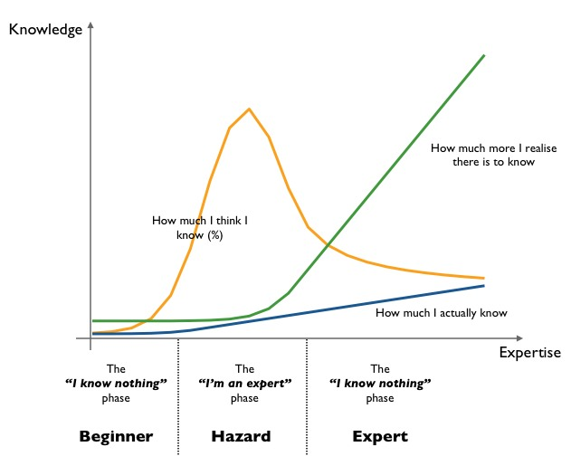
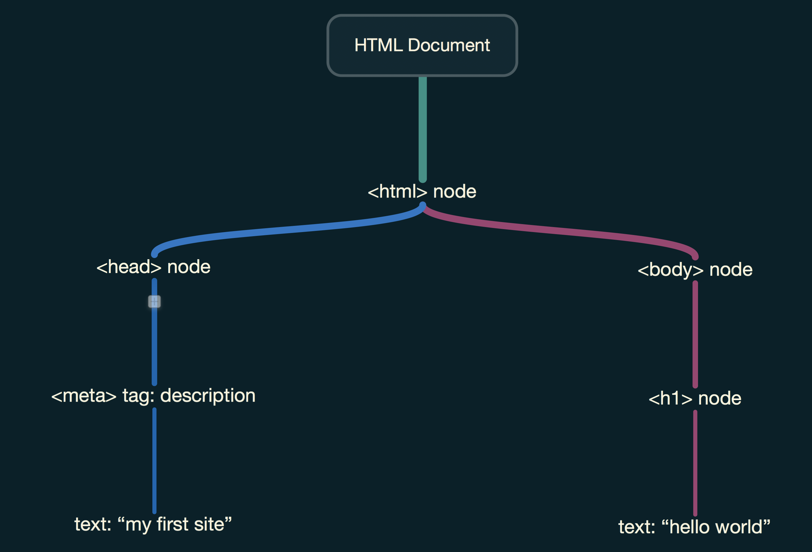
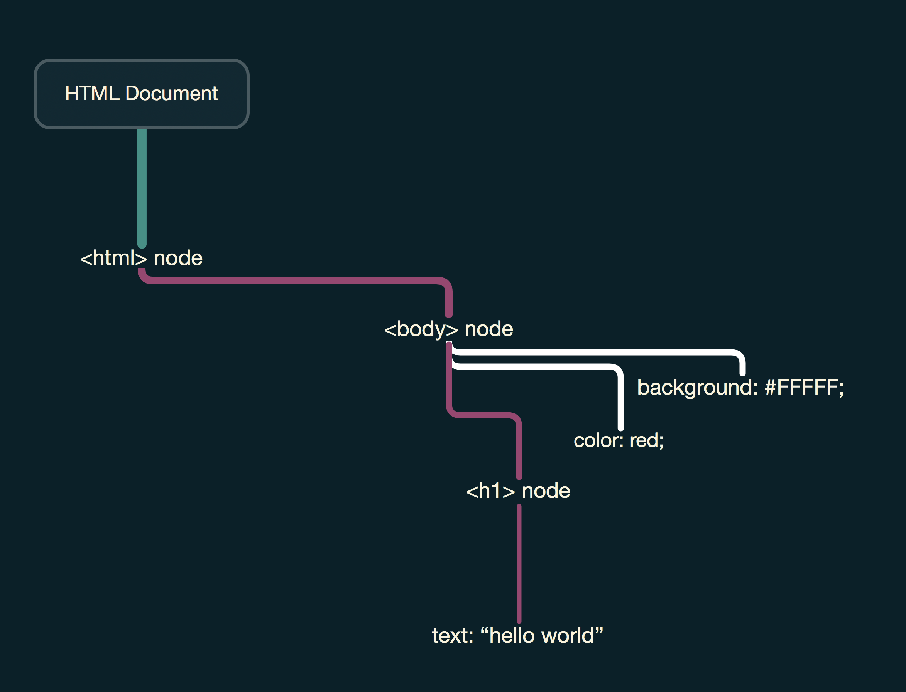
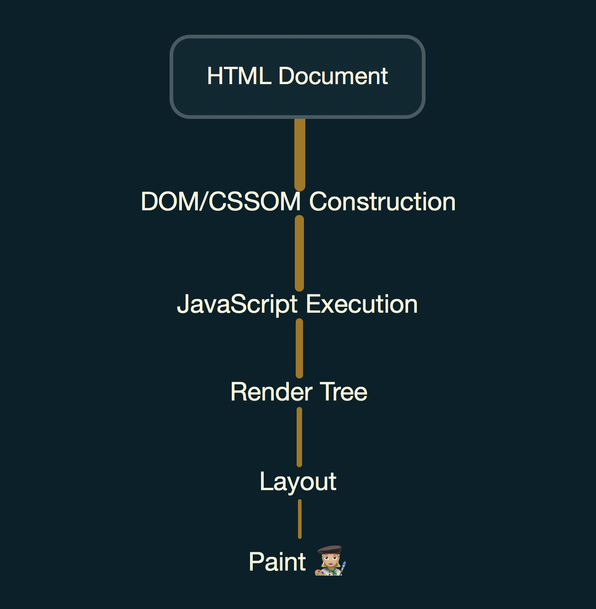

Looking back, it surprises me how long I coasted as a web developer without knowing how browsers _actually_ work.

Don't get me wrong--I had a general idea of the process: the static HTML file is requested and received, scripts and styles are loaded, and the JavaScript included on the page enables interaction without reload.

Having worked at a startup for a few years, I prioritized learning how to configure servers and networks, which gave me the (false) impression that my mental model for the web delivery process was fully formed.

It reminds me of the knowledge graph published by <a href="http://bradfrost.com/blog/post/atomic-web-design/" target="_blank">Atomic Design</a> creator Brad Frost:

<i>source: http://bradfrost.com/blog/post/i-have-no-idea-what-the-hell-i-am-doing/attachment/knowledge-graph/</i>

Although the mentioned topics provide enough working knowledge to successfully launch a site or deliver an MVP, they fall short of the understanding that stands out in an increasingly <a href="https://en.wikipedia.org/wiki/Time_to_first_byte" target="_blank">TTFB</a>-worshipping market, or for anyone who aims to optimize performance.

Because this blog is concerned with gathering knowledge and passing it along, what follows is a rundown of how browsers present sites like this, better known as the <b>critical rendering path</b>.

_Note: While there are several steps before a page is displayed online, this post will focus solely on how the browsers present content, starting with a fresh HTML file to render._

### Step One: Creating the DOM and CSSOM Trees

On the journey that is the CRP, the trailhead is (usually) an HTML file from some server on the web.

Upon receiving this asset, the first thing the browser does is build the DOM tree, or its own representation of the file's contents.

This involves parsing the resource line by line, tagging keywords it recognizes and converting them into nodes in a tree (processes known as tokenizing and lexing, respectively) along the way.

_Example DOM:_

<i>source: MindNode illustration

Once the DOM object is created, the browser needs to gather the object's style properties before rendering it. This is where CSSOM comes into play.

What is CSSOM? Well, most websites have styles associated with their markup. When the browser encounters a linked stylesheet or any other asset, it sends the request for said asset back to the server. During this time, its blocked from rendering the page until the response is returned. This is why CSS is commonly referred to as <b>render-blocking</b>.

If you think about it, this makes sense. The browser is aware that styles matter to the rendering process ahead, and it needs to interpret the information received as a whole due to the cascading nature of styles (hence the name, CSS).

Once the styles are received, interpreted, and applied, the JavaScript fetched by the browser is finally able to run.

### Step Two: JavaScript Execution

With the DOM constructed and styles identified, all JavaScript logic is executed. The modifying of content, styles, and other information needed to properly display the resource is done at this stage.

As more applications and services move toward web-first delivery, developers are increasingly relying on JavaScript to handle the brunt of the app logic. As such, this is the section that often causes the most bottleneck and is the main area to target when looking to optimize content delivery.

While the second part of this post will detail specifics on how to optimize site performance, it's worth mentioning that several excellent strategies have risen in recent years that profoundly expand the possibilities of what can be done over the web, including code splitting, service workers, tree shaking, and other powerful features.

### Step Three: Scaling the Render Tree

At this point, the HTML file received earlier has a corresponding DOM tree, or object representation, along with associated style information via the CSSOM. All JavaScript has loaded and executed, meaning our DOM and CSSOM are ready to be merged into the render tree and presented to the end user.

To construct the tree, each DOM node is traversed and inspected, and its matching CSSOM node is merged in to prepare for presentation.

It's worth mentioning that only _visible_ content is included in the constructed render tree. Meta information and nodes with styles that are set to not display are left out of the tree.

_Example render tree:_

<i>source: MindNode illustration

### Step Four: Assessing the Layout

During the next phase, commonly referred to as layout, or "reflow", the prep work for visualization is performed. Device dimensions are determined, informing the styles with information they'll need to properly render. To the pixel, the render tree is calculated to exist precisely as intended for the device used.

If you've ever noticed the boxy visualization at the bottom-right section of the developer tools in Chrome (within the "Elements" tab), you'll see the hard work of the layout phase at your disposal. This is known as the "box model" that has all the margin, padding, border, and pixel coordinate information about each element on the page.

### Step Five: Time to Paint

After all the hard work mentioned in previous sections is finished, it's finally time for the most straightforward process: converting the encoded information into pixels on the screen. In the last step, known as painting, the render tree and layout information are translated pixel by pixel into the content visible to the human eye.

In the second part of this article, I'll provide a few examples of how different styles affect the efficiency of the painting process. _(Spoiler alert: 200 MB background images with gradient overlays take longer to paint than, say, a white background)_.

### The Finished Product

To summarize, the five major steps the browser takes to present content are:

- Building the DOM and CSSOM trees
- Executing JavaScript that modifies and enhances the trees
- Merging the trees into one, superior render tree
- Calculating the layout information
- Painting the pixels to the screen

_The process, visualized:_

<i>source: MindNode illustration

After all these steps are complete, the website is ready for your viewing pleasure!

### Performance - Up Next

Now that we better understand the process for delivering content on the web, it's worth focusing on opportunities for optimization and enhancement.

In a follow-up post, I'll demonstrate a few best practices when building the modern web with a simple web application in vanilla JavaScript.

For more helpful resources on the subject, check out the following links.

- <a href="https://developers.google.com/web/fundamentals/performance/critical-rendering-path/" target="_blank">Google Web Fundamentals: Critical Rendering Path</a>
- <a href="https://bitsofco.de/understanding-the-critical-rendering-path/" target="_blank">Bits of Code: Understanding the Critical Rendering Path</a>
- <a href="https://medium.freecodecamp.org/an-introduction-to-web-performance-and-the-critical-rendering-path-ce1fb5029494" target="_blank">An introduction to Web Performance and the Critical Rendering Path</a>

As always, thanks for reading.
