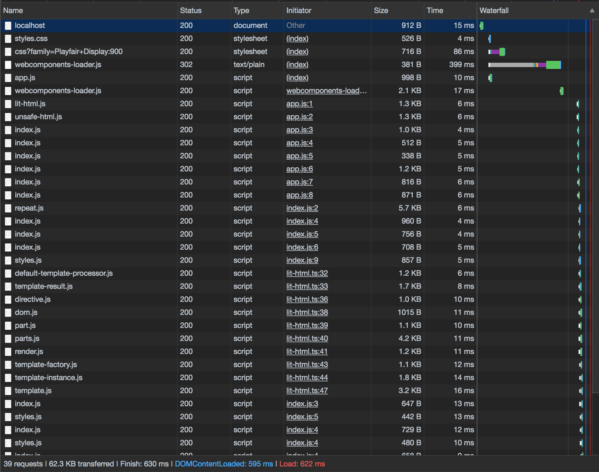
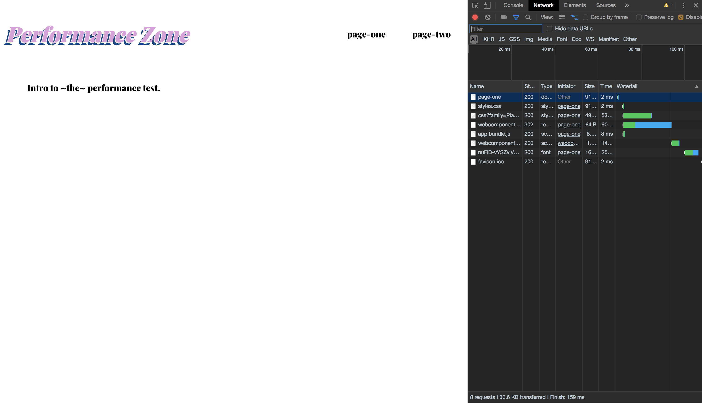
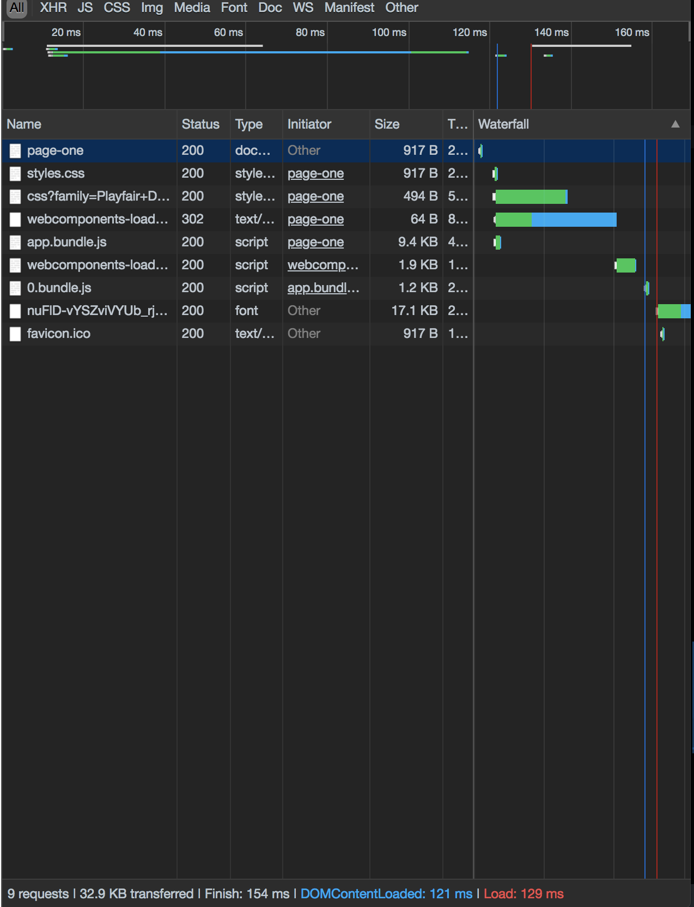

<div id="img-container">

<div class="src-container"><span class="source">Photo by Denisse Leon on Unsplash</span></div>
</div>

In the <a href="/05-treading-critical-rendering" target="_blank">previous post</a>, I walked through the details of the critical rendering path. It explained the process an HTML file goes through from being received by the browser all the way to its visualization on the page.

For the second half of this topic, I'll focus on ways developers can reduce the time and cost associated with these steps, making for a more performant, enjoyable user experience as a result.

To better illustrate the ideas, I'll walk through creating a simple SPA in ([mostly](#lit-section))\* vanilla JavaScript.

You can see the demo app <a href="https://vanilla-site-dzmkgredfp.now.sh/page-one" target="_blank">here</a>, or <a href="https://github.com/alephnode/vanilla-spa" target="_blank">view/clone the source on GitHub</a> and [skip the next section](#module-bundler) if you're here only for the performance tips.

Alright, let's get started!

### Building the Site

Before we can optimize the performance of a site, we need a site 😃. Luckily, I've prepared a basic project for us to work with.

The <a href="https://github.com/alephnode/vanilla-spa" target="_blank">repository</a> for this app provides two examples: one basic site, and the same site optimized. Because the project is relatively straightforward (mostly Web Component declarations), I'll only walk through the core modules before explaining the optimization steps.

The first module we'll look at is the base class from which all components, pages, and core app logic is derived.

_Note: all examples from the first section will be taken from the /basic directory, if you're following along with the source code._

_./basic/src/base/index.js:_

```javascript
import { render } from '/node_modules/lit-html/lit-html.js'

class Base extends HTMLElement {
  constructor() {
    super()
    this.attachShadow({ mode: 'open' })
  }

  connectedCallback() {
    this._render()
    this.onMount()
  }

  updateTpl() {
    this._render()
  }

  disconnectedCallback() {
    this.onUnmount()
  }

  dispatch(event, detail) {
    this.dispatchEvent(
      new CustomEvent(event, { detail, bubbles: true, composed: true })
    )
  }

  getChild(qry) {
    return this.shadowRoot.querySelector(qry)
  }

  getChildren(qry) {
    return this.shadowRoot.querySelectorAll(qry)
  }

  _render() {
    render(this.tpl(), this.shadowRoot)
  }

  /*abstract*/ onMount() {}
  /*abstract*/ onUnmount() {}
  /*abstract*/ tpl() {}
}

export default Base
```

If you're familiar with Web Components, much of the above should look familiar to you. If not, I'm effectively writing a few wrapper methods to offer more semantic names for lifecycle methods extended from HTMLElement. <div id="lit-section">\* I also pull in the only dependency in the project, _lit-html_, to render content to the page.</div>

If you haven't checked it out yet, <a href="https://lit-html.polymer-project.org/" target="_blank">_lit-html_</a> is a lightweight, intuitive library from the Polymer team that makes templating a breeze. It also just hit its first stable release, so it's worth taking a look.

Now that we've seen the base class used across the project, let's take a look at the main app module:

_./src/app.js:_

```javascript
import { html } from '/node_modules/lit-html/lit-html.js'
import { unsafeHTML } from '/node_modules/lit-html/directives/unsafe-html.js'
import Base from './base/index.js'
import registerComponent from './common/register-component/index.js'
import routes from './common/routes/index.js'
import './components/v-router/index.js'
import './pages/page-one/index.js'
import './pages/page-two/index.js'

class VApp extends Base {
  constructor() {
    super()
    this.navigate = this.navigate.bind(this)
  }

  onMount() {
    let page = location.pathname.substr(1)
    this.setActivePage((page && this.isRegistered(page)) || 'v-page-one')
    this.shadowRoot
      .querySelector('#root')
      .addEventListener('nav-changed', ({ detail: { route } }) =>
        this.navigate(route)
      )
  }

  navigate(route) {
    this.setActivePage(route)
  }

  setActivePage(page) {
    if (!page) return
    const pageTag = `<${page}></${page}>`
    this.htmlToRender = html`
      ${unsafeHTML(pageTag)}
    `
    history.pushState({}, page, page.split('v-')[1])
    this.updateTpl()
  }

  isRegistered(page) {
    return routes.indexOf(`v-${page}`) > -1 ? `v-${page}` : false
  }

  tpl() {
    return this.htmlToRender
      ? html`
          <style>
            #root {
              max-width: 1200px;
              margin: 0 auto;
            }
          </style>
          <div id="root">
            <v-router></v-router>
            ${this.htmlToRender}
          </div>
        `
      : ``
  }
}

registerComponent('v-app', VApp)
```

The app module's primary concern is maintaining control of the application's viewport, namely which page is currently being displayed. Whenever a new page is requested, the module checks to see if it has a corresponding component to render for that route. If not, it defaults to displaying the homepage.

The final line of the file (and every file with a Web Component declaration in the project) takes care of registration:

_./src/common/register-component/index.js:_

```javascript
export default (txt, className) => {
  if (customElements.get(txt)) return
  const register = () => customElements.define(txt, className)
  window.WebComponents ? window.WebComponents.waitFor(register) : register()
}
```

Although it's exciting to build apps almost entirely in JavaScript with Web Components, it _does_ come with some performance costs. A closer look at the "network" tab in Chrome's developer tools offers insight into this idea:

<div id="img-container">

</div>

As you can see (click the image to expand if needed), simply loading the page in the browser resulted in almost 40 resource requests from the browser. This high number of trips resulted in a page load speed of close to 700ms, which is pretty poor considering how little content is on the page.

Upon closer inspection, we can see that all those _index.js_ references are my Web Component declarations--many of which aren't even used on the first page. No good!

In order to get this app in better shape, let's take a look at a few of the optimization techniques available.

### <div id="module-bundler">Module Bundler</div>

If you've made it this far, you've either seen the skeleton of the example application or have a general idea of the issue at hand: building a site using mostly JavaScript while keeping the browser's requests light and as few as possible.

One of the most powerful tools available to help us accomplish this task is a <b>module bundler</b>. In short, it enables us to package all our app logic together in one file to minimize the number of requests needed to render our app.

Although the race has tightened recently with offerings like Rollup and Parcel, The leading solution for module bundling for the last few years has been <a href="https://webpack.js.org/" target="_blank">Webpack</a>.

In its simplest usage, it'll parse our JavaScript files from before--marking all dependencies along the way--and combine them into a single file that gets injected into _index.html_ after the build process.

In order to use Webpack in our project, we'll need to have install a few dependencies:

```bash
yarn add webpack webpack-dev-server html-webpack-plugin
```

To be clear, _webpack-dev-server_ is what we'll use to help preview our app during development, and _html-webpack-plugin_ enables the script injection described earlier.

Now that we have the dependencies installed, let's create a simple Webpack config file in the project's root.

_./webpack.config.js:_

```javascript
const webpack = require('webpack')
const { resolve } = require('path')
const HtmlWebpackPlugin = require('html-webpack-plugin')

module.exports = {
  context: resolve(__dirname, 'src'),
  entry: {
    app: './app.js',
  },
  output: {
    filename: '[name].bundle.js',
    path: resolve(__dirname, 'dist'),
  },
  devServer: {
    hot: true,
    publicPath: '/',
    historyApiFallback: true,
  },
  plugins: [
    new webpack.HotModuleReplacementPlugin(),
    new HtmlWebpackPlugin({
      template: resolve(__dirname, 'index.html'),
    }),
  ],
}
```

_Note that the Webpack file syntax uses CommonJS (all those require's at the top), which is different from the ES Modules we've used previously. For a refresher on the different module systems,_ <a href="https://medium.freecodecamp.org/anatomy-of-js-module-systems-and-building-libraries-fadcd8dbd0e" target="_blank">this article</a> _is a fantastic guide._

Looking deeper at the config above, we identify the entry point of our application, or _app.js_ as we linked in our _index.html_ previously, and define a location and file name for the eventual bundled output (app.bundle.js, in this case).

We also add a few configs for the dev server, specifically where to find our root HTML file, as well as the option to use _historyApiFallback_ for redirecting to our _index.html_ file on page refresh. Otherwise, the browser will request the HTML file from the server at the wrong location, and our users will get an ugly 404 error 😳.

Finally, the _HTMLWebpackPlugin_ allows us to customize the _index.html_ file created during the build by pointing to a template.

With our Webpack file in place, go ahead and run:

```bash
yarn start
```

to make sure your dev server is working. If everything looks good, you're ready to build!

```bash
yarn build
```

When the build is finished, navigate to the newly created _dist/_ directory and launch a static server. I like to use _serve_:

```bash
serve --single
```

If you inspect the resulting page in the network tab again, you should see all those scripts folded into _app.bundle.js_!

<div id="img-container">

</div>

As the image shows, the requests dropped to a measly eight, and the page loaded in ~150ms.

This is good, but we could do better. Notice upon inspecting the _app.bundle.js_ file that components are loaded that aren't used on the page, like _v-page-two_ and _v-img-container_.

_app.bundle.js_:

<div id="img-container">

</div>

To fix this, we'll use another tool on the modern web's workbench: _code splitting_!

### Code Splitting

One of the coolest features that Webpack supports is the ability to programmatically load files at your discretion rather than requiring everything all at once.

Using this feature is simple. Let's head back to the _app.js_ file and refactor the code to use this feature.

_app.js:_

```javascript
/// ... Vapp class from before ...
  async onMount() {
    let page = location.pathname.substr(1)
    await this.setActivePage((page && this.isRegistered(page)) || 'v-page-one')
    this.shadowRoot
      .querySelector('#root')
      .addEventListener('nav-changed', ({ detail: { route } }) => this.navigate(route)
      )
  }

  navigate(route) {
    this.setActivePage(route)
  }

  async setActivePage(page) {
    if (!page) return
    let prettyName = page.split('v-')[1]
    const pageTag = `<${page}></${page}>`
    this.htmlToRender = html`
      ${unsafeHTML(pageTag)}
    `
    history.pushState({}, page,prettyName)
    // Here's the interesting part ...
    await import(`./pages/${prettyName}`)
    this.updateTpl()
  }
  // ...
```

First, we remove the two page component references in _app.js_. Then, we use async/await to 1. wait for _setActivePage()_ to finish, where our dynamic import will happen, and 2. wait for the module to import before updating the markup.

Now, our page modules will only be requested from the browser when we navigate to their corresponding page.

Let's check the dev tools again to see our progress:

<div id="img-container">

</div>

Down to nine requests at ~129ms, not bad!

### Service Worker

Our app has made considerable progress with just a few short config options, but there's another technique that'll increase performance for users on repeat visits as well: implementing a <strong>service worker</strong>.

### Wrapping Up

With a few modifications to our original project, we were able to increase the page load time by a factor of XX. Thanks to the minification, bundling, and code splitting capabilities of Webpack--paired with a service worker with sensible configs--we can ship a JavaScript-powered web app without the bloat plaguing so many projects in the space.

Although we touched on quite a few options in this article, there are still plenty of ways to push the performance envelope even further. Below are a few articles that go into more detail, as well as offer additional performance tweaks:

- cookie expiration article
- tree shaking example
- advanced service worker, cache busting article
