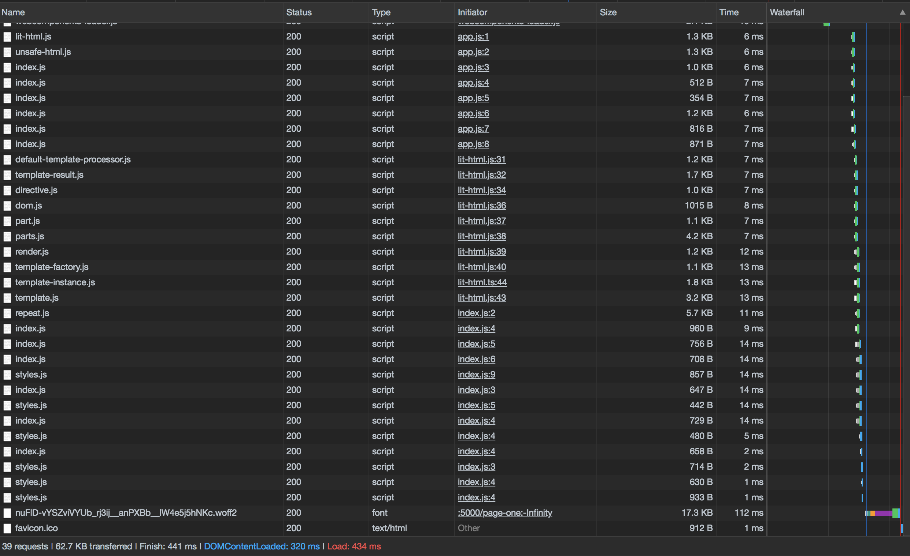
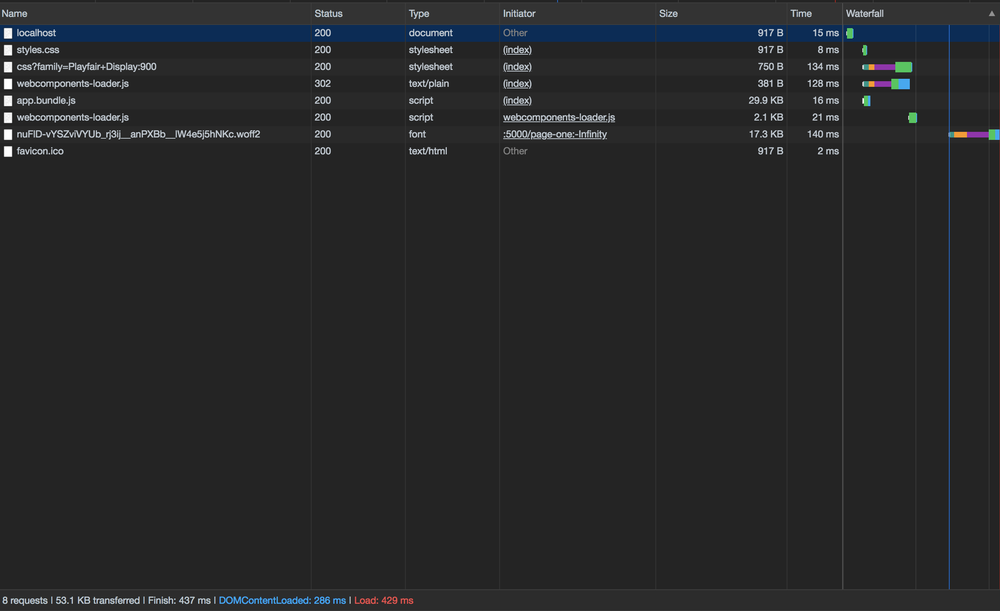
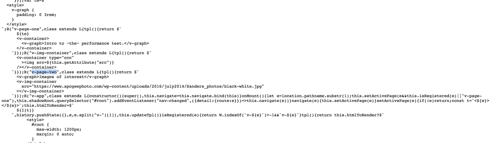
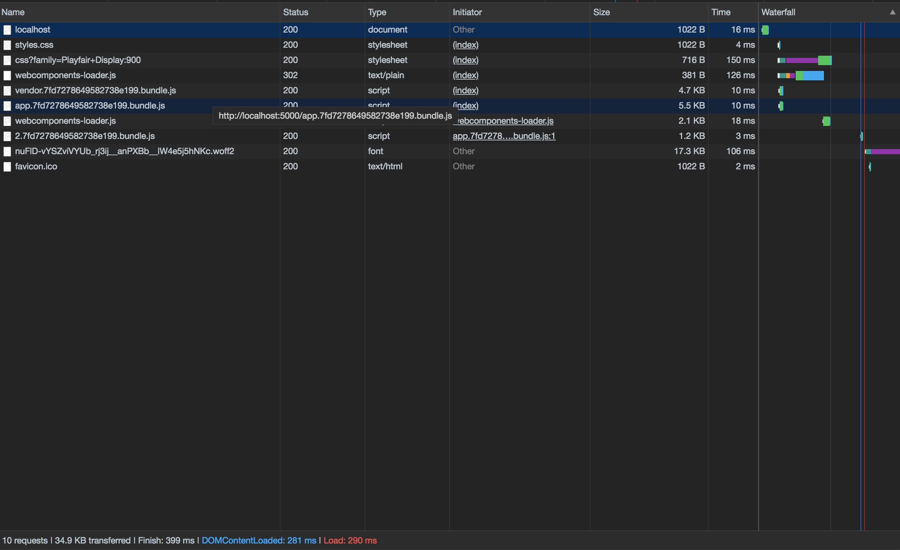
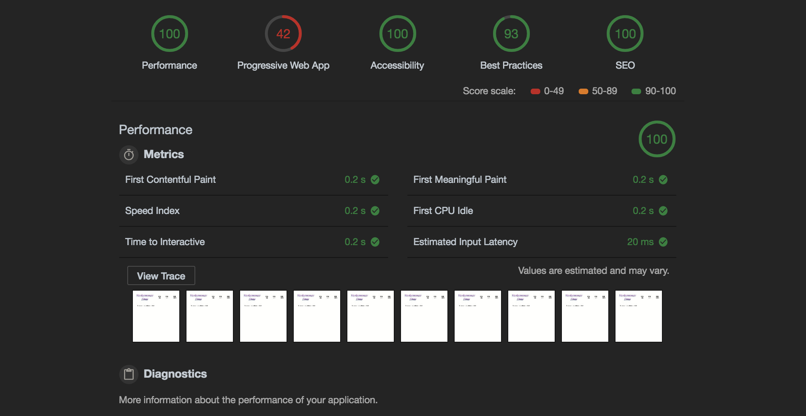
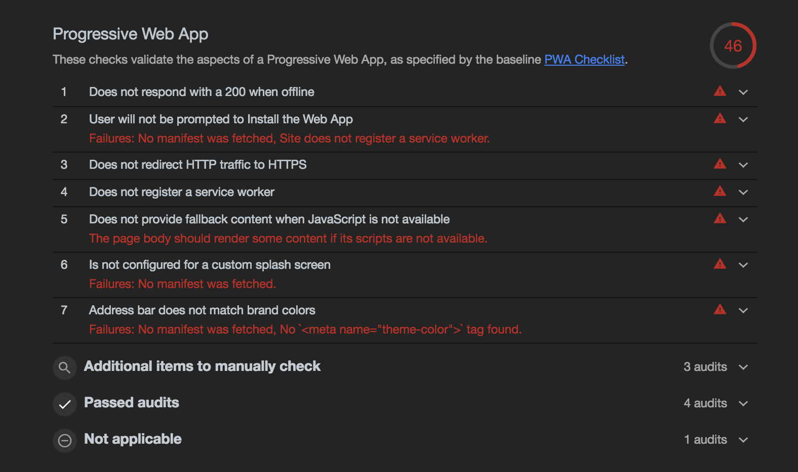
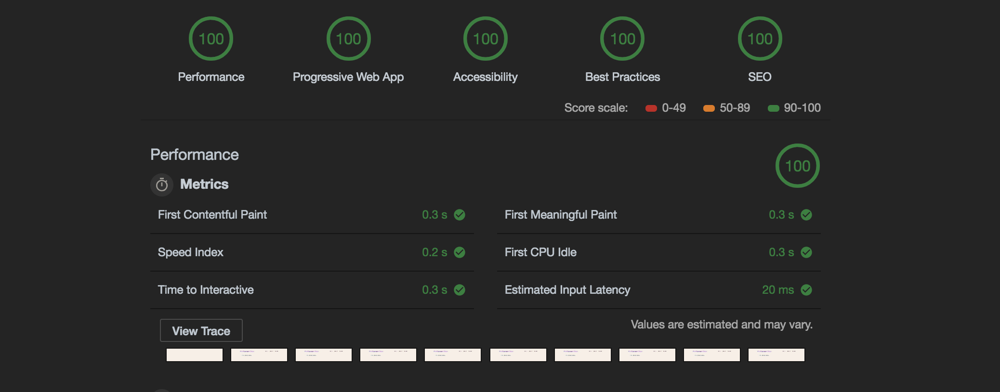

<div id="img-container">

<div class="src-container"><span class="source">Photo by Denisse Leon on Unsplash</span></div>
</div>

In the <a href="/05-treading-critical-rendering" target="_blank">previous post</a>, I walked through the details of the critical rendering path. It explained how an HTML file goes from arrival at the browser to its visualization on the page.

For the second half of the topic, I'll focus on a few ways developers can reduce the time and cost associated with these steps, making for a more performant, enjoyable user experience as a result.

To better illustrate the ideas, I've prepared a simple app in ([mostly](#lit-section))\* vanilla JavaScript.

You can see the demo app <a href="https://vanilla-spa.netlify.com" target="_blank">here</a>, or <a href="https://github.com/alephnode/vanilla-spa" target="_blank">view/clone the source on GitHub</a> and [skip the next section](#module-bundler) if you don't care to read details about the example site.

### Exploring the Site

The <a href="https://github.com/alephnode/vanilla-spa" target="_blank">repository</a> for this project provides two examples: one basic site and one optimized. Because the project is relatively straightforward (mostly Web Component declarations), I'll walk through only the core modules before explaining the optimization steps.

The first module of focus is the base class from which all components, pages, and core app logic is derived.

_./basic/src/base/index.js:_

```javascript
import { render } from '/node_modules/lit-html/lit-html.js'

class Base extends HTMLElement {
  constructor() {
    super()
    this.attachShadow({ mode: 'open' })
  }

  connectedCallback() {
    this._render()
    this.onMount()
  }

  updateTpl() {
    this._render()
  }

  disconnectedCallback() {
    this.onUnmount()
  }

  dispatch(event, detail) {
    this.dispatchEvent(
      new CustomEvent(event, { detail, bubbles: true, composed: true })
    )
  }

  getChild(qry) {
    return this.shadowRoot.querySelector(qry)
  }

  getChildren(qry) {
    return this.shadowRoot.querySelectorAll(qry)
  }

  _render() {
    render(this.tpl(), this.shadowRoot)
  }

  /*abstract*/ onMount() {}
  /*abstract*/ onUnmount() {}
  /*abstract*/ tpl() {}
}

export default Base
```

If you're familiar with Web Components, much of the above should look familiar. If not, I'm writing a few semantic wrapper functions for the lifecycle methods extended from HTMLElement. <div id="lit-section">\* I also pull in the only dependency in the project, _lit-html_, to render content to the page.</div>

If you haven't checked it out yet, <a href="https://lit-html.polymer-project.org/" target="_blank">_lit-html_</a> is a lightweight, intuitive library from the Polymer team that makes templating a breeze. It also just hit its first stable release, so it's worth taking a look.

Now that we've seen the base class used across the project, let's take a look at the main app module:

_./basic/src/app.js:_

```javascript
import { html } from '/node_modules/lit-html/lit-html.js'
import { unsafeHTML } from '/node_modules/lit-html/directives/unsafe-html.js'
import Base from './base/index.js'
import registerComponent from './common/register-component/index.js'
import routes from './common/routes/index.js'
import './components/v-router/index.js'
import './pages/page-one/index.js'
import './pages/page-two/index.js'

class VApp extends Base {
  constructor() {
    super()
    this.navigate = this.navigate.bind(this)
  }

  onMount() {
    let page = location.pathname.substr(1)
    this.setActivePage((page && this.isRegistered(page)) || 'v-page-one')
    this.shadowRoot
      .querySelector('#root')
      .addEventListener('nav-changed', ({ detail: { route } }) =>
        this.navigate(route)
      )
  }

  navigate(route) {
    this.setActivePage(route)
  }

  setActivePage(page) {
    if (!page) return
    const pageTag = `<${page}></${page}>`
    this.htmlToRender = html`
      ${unsafeHTML(pageTag)}
    `
    this.updateTpl()
  }

  isRegistered(page) {
    return routes.indexOf(`v-${page}`) > -1 ? `v-${page}` : false
  }

  tpl() {
    return this.htmlToRender
      ? html`
          <style>
            #root {
              max-width: 1200px;
              margin: 0 auto;
            }
          </style>
          <div id="root">
            <v-router></v-router>
            ${this.htmlToRender}
          </div>
        `
      : ``
  }
}

registerComponent('v-app', VApp)
```

The app module's primary concern is maintaining control of the application's viewport, namely which page is currently being displayed. Whenever a new page is requested, the module checks to see if it has a corresponding component to render for that route. If not, it defaults to displaying the homepage.

The final line of the file (and every file with a Web Component declaration in the project) takes care of registration:

_./basic/src/common/register-component/index.js:_

```javascript
export default (txt, className) => {
  if (customElements.get(txt)) return
  const register = () => customElements.define(txt, className)
  window.WebComponents ? window.WebComponents.waitFor(register) : register()
}
```

After fleshing out a few more components and examining the project in the browser, it's noticeable that this small site with a few pages comes with some performance costs.

A closer look at the "network" tab in Chrome's developer tools offers insight into this idea:

<div id="img-container">

</div>

As you can see (click the image to expand if needed), simply loading the page in the browser resulted in almost 40 resource requests and about 63 KB sent from the server.

While the size isn't _massive_, it's also just a simple app with hardly any content. Adding more images, API calls, and boilerplate pages would easily double or triple this number.

Upon closer inspection, we can see that many of the file references are my Web Component declarations--many of which aren't even used on the first page. No good!

In order to get this app in better shape, let's take a look at a few of the optimization techniques available.

### First Things First: Check Your Images

Before delving deep into config options and code tweaks, it's worth mentioning that unchecked images are often the cause of bulky page sizes.

The easiest way to reduce image size is to run them through a compression tool. There are a few different options online, but I enjoy <A href="https://compressor.io/" target="_blank">Compressor IO </a> for my optimization needs.

It's also beneficial to prefer JPEG over PNG assets for photos and other complex images. This is because of the compression algorithm JPEG uses, lossy, which removes pixel data (unlike PNG, which is lossless).

Once you've made a pass through the assets referenced on your page, it's time to look at code-side optimizations worth making.

### <div id="module-bundler">Module Bundler</div>

If you've made it this far, you've either seen the skeleton of the example application or have a general idea of the issue at hand: building a site using mostly JavaScript while keeping the browser's requests light and as few as possible.

One of the most powerful tools available to help us accomplish this task is a <b>module bundler</b>. In short, it enables us to package all our app logic together in one file to minimize the number of requests needed to render our app.

Although the race has tightened recently with offerings like Rollup and Parcel, The leading solution for module bundling for the last few years has been <a href="https://webpack.js.org/" target="_blank">Webpack</a>.

In its simplest usage, it'll parse our JavaScript files from before--marking all dependencies along the way--and combine them into a single file that gets injected into _index.html_ after the build process.

In order to use Webpack in our project, we'll need to install a few dependencies:

```bash
yarn add webpack webpack-dev-server html-webpack-plugin
```

To be clear, _webpack-dev-server_ is what we'll use to help preview our app during development, and _html-webpack-plugin_ enables the script injection described earlier.

Now that we have the dependencies installed, let's create a simple Webpack config in the project's root.

_./optimized/webpack.config.js:_

```javascript
const webpack = require('webpack')
const { resolve } = require('path')
const HtmlWebpackPlugin = require('html-webpack-plugin')

module.exports = {
  context: resolve(__dirname, 'src'),
  entry: {
    app: './app.js',
  },
  output: {
    filename: '[name].bundle.js',
    path: resolve(__dirname, 'dist'),
  },
  devServer: {
    hot: true,
    publicPath: '/',
    historyApiFallback: true,
  },
  plugins: [
    new webpack.HotModuleReplacementPlugin(),
    new HtmlWebpackPlugin({
      template: resolve(__dirname, 'index.html'),
    }),
  ],
}
```

_Note that the Webpack file syntax uses CommonJS (all those require's at the top), which is different from the ES Modules we've used previously. For a refresher on the different module systems,_ <a href="https://medium.freecodecamp.org/anatomy-of-js-module-systems-and-building-libraries-fadcd8dbd0e" target="_blank">this article</a> _is a fantastic guide._

Looking deeper at the config above, we identify the entry point of our application, or _app.js_ as we linked in our _index.html_ previously, and define a location and file name for the eventual bundled output (app.bundle.js, in this case).

We also add a few configs for the dev server, specifically where to find our root HTML file, as well as the option to use _historyApiFallback_ for redirecting to our _index.html_ file on page refresh. Otherwise, the browser will request the HTML file from the server at the wrong location, and our users will get an ugly 404 error 😳.

Finally, the _HTMLWebpackPlugin_ allows us to customize the _index.html_ file created during the build by pointing to a template.

With our Webpack file in place, go ahead and run:

```bash
webpack-dev-server --mode development
```

to make sure your dev server is working. If everything looks good, you're ready to build!

```bash
webpack -p
```

When the build is finished, navigate to the newly created _dist/_ directory and launch a static server. I like to use <a href="https://github.com/zeit/serve" target="_blank">_serve_</a>:

```bash
serve --single
```

If you inspect the resulting page in the network tab again, you should see all those scripts folded into _app.bundle.js_!

<div id="img-container">

</div>

As the image shows, the requests dropped to a measly eight, and the total page size is now 53.1 KB.

This is good, but we could do better. Notice upon inspecting the _app.bundle.js_ file that components are loaded that aren't used on the page, like _v-page-two_ and _v-img-container_.

_./optimized/dist/app.bundle.js_:

<div id="img-container">

</div>

To fix this, we'll use another tool on the modern web's workbench: _code splitting_!

### Code Splitting

One of the most useful features that Webpack offers is programmatically loading modules inline rather than requiring static imports at the top of the dependent file. This is referred to as _code splitting_.

Using this feature is simple. Let's head back to the _app.js_ file and refactor the code to use this feature.

_./optimized/src/app.js:_

```javascript
/// ... Vapp class from before ...
  async onMount() {
    let page = location.pathname.substr(1)
    await this.setActivePage((page && this.isRegistered(page)) || 'v-page-one')
    this.shadowRoot
      .querySelector('#root')
      .addEventListener('nav-changed', ({ detail: { route } }) => this.navigate(route)
      )
  }

  navigate(route) {
    this.setActivePage(route)
  }

  async setActivePage(page) {
    if (!page) return
    let prettyName = page.split('v-')[1]
    const pageTag = `<${page}></${page}>`
    this.htmlToRender = html`
      ${unsafeHTML(pageTag)}
    `
    history.pushState({}, page,prettyName)
    // Here's the interesting part ...
    await import(`./pages/${prettyName}`)
    this.updateTpl()
  }
  // ...
```

First, we remove the two page component references in _app.js_. Then, we use async/await to

1. wait for _setActivePage()_ to finish, where our dynamic import will happen, and
2. wait for the module to import before updating the markup.

Now, our page modules will only be requested from the browser when we navigate to their corresponding page.

Let's check the dev tools again to see our progress:

<div id="img-container">

</div>

Cutting the content delivered down by ~56% (to 34.9 KB) is quite an achievement, but we can still do better. To gain a little more insight, let's head over to another section of the dev tools: the <strong>Audits</strong> tab.

### Auditing Performance

When we run an audit on the site, we see a lot of stellar scores with a glaring outlier:

<div id="img-container">

</div>

Yikes, someone bombed a section of the test! Let's drill in and see what's causing the poor marks:

<div id="img-container">

</div>

The section in question, _Progressive Web App_, measures how gracefully the site handles network loss and caching through the use of a service worker. Although some of these suggestions might seem like overkill, it's worth peppering them into an application to adhere to best practices.

### Manifest.json

The easiest task I spot on the list is creating a _manifest.json_ file. If you're not sure why this file is useful, you can read more about it <a href="https://developers.google.com/web/fundamentals/web-app-manifest/" target="_blank">here</a>.

In short, it provides the browser with information about your page to supply to users when saving the site to their devices. Let's create one now.

_./optimized/manifest.json:_

```json
{
  "short_name": "perf-zone",
  "name": "Performance Zone",
  "icons": [
    {
      "src": "/icons/site-icon.png",
      "type": "image/png",
      "sizes": "192x192"
    },
    {
      "src": "/icons/site-icon-512.png",
      "type": "image/png",
      "sizes": "512x512"
    }
  ],
  "start_url": "/",
  "background_color": "#000000",
  "display": "standalone",
  "theme_color": "#000000"
}
```

Being JSON, many of the properties are self-documenting. You set a few name variables, identify icons and theming to use for the app, and fill in a few other configs.

One important property to set is "start_url". It's the page the browser will direct users to when they launch your app.

The "standalone" setting on the "display" property will launch the site without an address bar/tooling so it looks and feels like a native app.

In order for the browser to know about this file, I include a reference in my _index.html_ file template:

```html
<!DOCTYPE html>
<html lang="en">
  <head>
    <meta charset="UTF-8" />
    <meta name="viewport" content="width=device-width, initial-scale=1.0" />
    <meta name="description" content="Sample site" />
    <meta name="theme-color" content="#000000" />
    <link rel="manifest" href="/manifest.json" />
    <meta http-equiv="X-UA-Compatible" content="ie=edge" />
    <title>Vanilla Site</title>
    <link
      href="https://fonts.googleapis.com/css?family=Playfair+Display:900"
      rel="stylesheet"
    />
    <script src="https://unpkg.com/@webcomponents/webcomponentsjs/webcomponents-loader.js"></script>
  </head>
  <body>
    <v-app></v-app>
    <noscript
      >If you don't allow JavaScript, you're going to have a bad time
      here!</noscript
    >
  </body>
</html>
```

I also threw in a noscript tag to appease the browser's fallback content request.

Next, I installed `copy-webpack-plugin` and created some icons and a simple _robots.txt_ file so my new config files make their way into my build directory when I'm ready to deploy:

```javascript
// ...webpack config...
  plugins: [
    new CopyWebpackPlugin([
      {
        from: './static',
        to: './',
      },
    ]),
  ],
  // ...webpack config...
```

Now with fallback content, _manifest.json_, and a _robots.txt_ served, it's time to tackle the real culprit of the poor grade: the _service worker_.

### Service Worker

Service workers are scripts that run in the background of your application, separate from the app logic used for the site itself. This is useful for features such as caching, push notifications, and offline asset delivery. For more information, Google has published a <a href="https://developers.google.com/web/fundamentals/primers/service-workers/" target="_blank">thorough overview</a>.

For our purposes, we'll implement a basic example that gives us the features Google requires to pass its audit.

_./optimized/src/static/sw.js:_

```javascript
self.addEventListener('install', function(e) {
  e.waitUntil(
    caches.open('perf-zone').then(function(cache) {
      return cache.addAll([
        '/',
        '/index.html',
        '/app.bundle.js',
        'vendor.bundle.js',
      ])
    })
  )
})

self.addEventListener('fetch', function(e) {
  e.respondWith(
    caches.match(e.request).then(function(res) {
      return res || fetch(e.request)
    })
  )
})
```

The service worker created consists of two event listeners. The first creates a new cache and adds our important resources (the index file as well as our app and vendor bundles).

Next, we listen for fetch events and intercept them with the corresponding logic. If the content exists in the cache, serve it, otherwise continue the fetch request.

This is how we're able to still serve the site even if the user is offline; they're pulling the necessary resources from their device rather than a network request.

After the file is created, I reference it in _index.html_.

_./optimized/index.html:_

```html
<script>
  if ('serviceWorker' in navigator) {
    navigator.serviceWorker.register('/sw.js').then(function() {
      console.log('Service Worker Registered')
    })
  }
</script>
```

After a simple check for browser compatibility, we register the service worker and print a message to the console confirming its success.

With my service worker written and the file referenced in _index.html_, I'm ready to deploy this site and see the results.

For a simple, reliable SPA deployment with easy /index.html fallback policies for our static routes, we're going to use <a href="https://www.netlify.com/" target="_blank">Netlify</a>. It also gives us https out of the box, which we'll need to implement our service worker.

_Note: If you're following along, you'll want to_ <a href="https://app.netlify.com/signup" target="_blank">_create an account_</a> _on Netlify's site and_ <a href="https://www.netlify.com/docs/cli/" target="_blank">_install their cli tools_</a> _before continuing._

The only thing stopping the site from being ready is a simple redirect rule that lets Netlify know how to handle our static routes. To accomplish this, we'll write a quick config file that'll live in our static directory that gets copied into our build:

./optimized/src/static/\_redirects:

```
/*    /index.html   200
```

To deploy the site, I build the project again and navigate to the _/dist_ directory. Then I deploy from the CLI by running:

```bash
netlify deploy --production
```

It'll ask for the path, which defaults to the current directory. It then prints the url for the app in the terminal.

Once we navigate to the site and run the audit one last time, we see the results we've been ever-so patiently waiting for:

<div id="img-container">

</div>

We did it 🎉!

### A Note on Service Workers

Keep in mind that service workers have their drawbacks, namely in cache busting. For this reason, it's common practice to add a hash value to your resources to easily deregister outdated files.

In Webpack, this is as easy as adding the [hash] keyword to your bundle names in the output section.

Ex:

```javascript
// ...
  output: {
    filename: '[name].[hash].bundle.js',
    chunkFilename: '[name].[hash].bundle.js',
    path: resolve(__dirname, 'dist'),
  },
// ...
```

Then, to help automate the process of service worker configuration, I would recommend the <a href="https://github.com/goldhand/sw-precache-webpack-plugin" target="_blank">SW Precache Webpack Plugin</a> (thorough documentation provided in their linked GitHub page).

### Wrapping Up

With a few modifications to our original project, we were able to decrease the page load time, optimize our caching strategy and handle offline requests.

Thanks to the minification, bundling, and code splitting capabilities of Webpack--paired with a service worker with sensible configs--we can ship a JavaScript-powered web app without the bloat plaguing so many projects in the space.

Although we touched on several options in this article, there are still plenty of ways to push the performance envelope even further. Below are a few articles that go into more detail, as well as offer additional performance tweaks:

- <a href="https://webpack.js.org/guides/tree-shaking/" target="_blank">Webpack tree shaking example</a>
- <a href="https://developers.google.com/web/showcase/2015/service-workers-iowa" target="_blank">advanced service worker, cache busting</a>
- <a href="https://http2.github.io/" target="_blank">HTTP2 info, simple server setup</a>

As always, thanks for reading.
