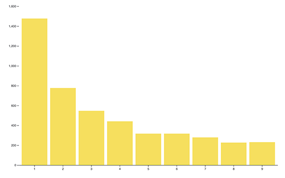

<div id="img-container">

<div class="src-container"><span class="source">Photo by Chris Liverani on Unsplash</span></div>
</div>

During my stint as a journalist, my interests floated toward data visualization and visual storytelling. To me, a dense, detailed graphic could convey information just as efficiently as the written word.

Given that a recent goal was to experiment with creating graphics for the web, I dug into the documentation for <a href="https://d3js.org/" target="_blank">d3.js</a>. It's been a popular visualization library for years and has scores of tutorials online.

It was through that library's homepage that I discovered Observable, a new site that enables users to publish self-contained collections of code with little effort.

### What is Observable?

In Observable, projects are encapsulated in items called "notebooks." Per Observable's <a href="https://observablehq.com/@observablehq/introduction-to-notebooks" target="_blank">introduction article</a>, a notebook is: "_an interactive, editable document defined by code._" It can be used to explore data or present new ideas.

If you've ever worked with the <a href="https://jupyter.org/" target="_blank">Jupyter Notebook</a> software from the world of Python, this concept should feel familiar. You have cells to implement code or markdown piecemeal, and feedback is immediate when the code has issues.

To try out the service, I thought I'd explore one of my favorite topics in Math: Benford's Law.

You can find the notebook associated with this article <a href="https://observablehq.com/@alephnode/benfords-law-top-5000-youtube-channels-edition" target="_blank">here</a>, or keep reading for a walkthrough on creating the visualization.

Before we start with the notebook, though, it's worth briefly summarizing Benford's law for the unfamiliar.

### Benford's Law: Description, Backstory

When it comes to statistical models, no formula comes close to the popularity and prevalence of the normal distribution.

This is fair; it uncovers the relationships underlying much of the world around us. Patterns in datasets related to science, economics, and other areas of study are better identified and predicted as a result of this versatile formula.

About 75 years after the bell curve was published by Carl Friedrich Gauss, another theorist made a clever observation: often, the leading digits of numbers in a set don't follow this pattern.

<div id="img-container">

<div class="src-container"><span class="source">Example distribution following Benford's law</span></div>
</div>

In 1881, the Canadian-American mathematician <a href="https://www.britannica.com/biography/Simon-Newcomb" target="_blank">Simon Newcomb</a> observed that the natural numbers appeared in a descending order of commonality (starting at 1) as the first digit in a number. This led him to publish <a href="http://www.uvm.edu/pdodds/files/papers/others/1881/newcomb1881a.pdf" target="_blank">"Note on the Frequency of Use of the Different Digits in Natural Numbers"</a>, which highlighted this observation after working with log tables.

Although Newcomb was the first to document this pattern, it wasn't until Frank Benford presented a clear formula and several examples in <a href="https://www.scribd.com/document/209534421/The-Law-of-Anomalous-Numbers" target="_blank">"The Law of Anomalous Numbers"</a> in 1938 that the law took shape. In this seminal work, Benford used the atomic weight of chemical compounds, death rates, newspaper appearances, and other datasets to show just how common this pattern is. Because of this, the law carries his name.

Today, Benford's law is used across disciplines to check, among other things, the validity of datasets and to prevent fraud. Specifically in finance and data science, applying the law to sections of a dataset can quickly uncover whether numbers have been compromised or fabricated.

### The Project

Alright, let's find an example of Benford's law out in the wild.

If you'd like to follow along, create a new notebook from the Observable dashboard and name it whatever you'd like.

For my dataset, I'm going to use the Top 5000 YouTube channels collection via <a href="https://www.kaggle.com/mdhrumil/top-5000-youtube-channels-data-from-socialblade" target="_blank">Kaggle</a>. If you haven't checked it out yet, Kaggle is an excellent resource for open-source data exploration.

I'll start the project by importing d3, which will be used to visualize the dataset.

```javascript
d3 = require('d3@5')
```

_Note Because the convention for many notebooks is to lead with the most important information at the top and cascade down, I'm going to add each new cell above the previous one._

In a new cell, we'll pull in the dataset for the project:

```javascript
data = d3.csv(
  'https://s3-us-west-2.amazonaws.com/alphnode-benfords-law-youtube-channel-stats/data.csv'
)
```

After examining the collection, I see that the subscription counts for each YouTube channel seem testable for Benford's law: they're a large set of numbers that don't have minimum/maximum limits or anything that would cap or skew them.

To retrieve the first digit in each subscriber count, I'll write a function that filters through the list, keeping only the cells where the number passed to the function is the first.

```javascript
getLeadingDigitCount = n =>
  data.filter(d => parseInt(d['Subscribers'][0]) === n).length
```

Next, I pass each number, 1-9, into the function and store the resulting array into a variable called _counts_:

```javascript
counts = [1, 2, 3, 4, 5, 6, 7, 8, 9].map(n => ({
  name: n,
  count: getLeadingDigitCount(n),
}))
```

Alright, time for the heavy lifting: defining our chart.

```javascript
chart = {

  let margin = ({top: 20, right: 0, bottom: 50, left: 35});
  let width = 900;
  let  height = 600;

  let y = d3.scaleLinear()
    .domain([0, d3.max(counts, d => d.count)]).nice()
    .range([height - margin.bottom, margin.top]);

  let x = d3.scaleBand()
    .domain(counts.map(d => d.name))
    .range([margin.left, width - margin.right])
    .padding(0.1);

  let yAxis = g => g
    .attr("transform", `translate(${margin.left},0)`)
    .call(d3.axisLeft(y))
    .call(g => g.select(".domain").remove());

  let xAxis = g => g
    .attr("transform", `translate(0,${height - margin.bottom})`)
    .call(d3.axisBottom(x).tickSizeOuter(0));

  const svg = d3.select(DOM.svg(width, height));

  svg.append("g")
      .attr("fill", "#FAE03C")
    .selectAll("rect")
    .data(counts)
    .join("rect")
      .attr("x", d => x(d.name))
      .attr("y", d => y(d.count))
      .attr("height", d => y(0) - y(d.count))
    .attr("width", x.bandwidth());
  svg.append("g")
      .call(xAxis);
  svg.append("g")
      .call(yAxis);

  return svg.node();
}
```

There's a lot to unpack here. First, we define some values for presenting the graph: margin, width, and height. We then use d3's _scaleLinear()_ method to calculate the x and y ranges of our graph based on the dataset's values, eliminating guesswork.

Next up are functions that'll calculate the transformations to properly display our svg graphic. Once they're defined, we can create a new d3 selection and append the necessary `<g>` elements, iterating through our data's relevant properties to build the bar chart. We finally return _svg.node()_ to display the DOM element created.

Once we have our cells defined, we see the resulting graph that shows how well our set follows Benford's law:

<div id="img-container">

<div class="src-container"><span class="source">Top 5000 YouTube Channel Subscribers - Leading Digit Distribution</span></div>
</div>

Not bad! It looks like the expected exponentially decreasing curve is present. If you missed the link earlier, you can view the published notebook <a href="https://observablehq.com/@alephnode/benfords-law-top-5000-youtube-channels-edition" target="_blank">here</a>.

### Wrapping Up

As illustrated above, Observable provides an excellent environment for presenting or exploring datasets on the fly with marginal setup.

Here are a few additional resources if this topic piqued your interest:

- <a href="http://www.ams.org/publicoutreach/feature-column/fcarc-newcomb" target="_blank">Reference: American Mathematical Society Article on Benford's Law</a>
- <a href="https://rosettacode.org/wiki/Benford%27s_law" target="_blank">Benford's Law - Rosetta Code Implementations</a>
- <a href="https://observablehq.com/@observablehq/five-minute-introduction" target="_blank">Observable - Five Minute Introduction</a>
- <a href="https://www.youtube.com/watch?v=XXjlR2OK1kM" target="_blank">Number 1 and Benford's Law - Numberphile</a>
- <a href="http://testingbenfordslaw.com/" target="_blank">Testing Benford's Law</a>

As always, thanks for reading!
