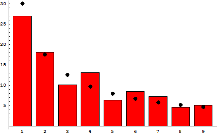

Photo by Chris Liverani on Unsplash

During my stint as a journalist, my interests floated toward data visualization and visual storytelling. To me, a dense, detailed graphic could convey information just as efficiently as a verbose write-up.

Given that a recent goal was to experiment with creating graphics on the web, I naturally gravitated toward <a href="https://d3js.org/" target="_blank">d3.js</a>. It's been a popular visualization library for years and has loads of experience supporting other languages.

It was through that library's documentation that I discovered Observable and was able to build out a few ideas in little time.

### What is Observable?

An Observable notebook is an application that lets you run snippets of contained JavaScript code in a series, similar to the popular Jupyter Notebook software from the world of Python.

What's more, JS also has its own data manipulation and analysis library, Zebras.js. If you've used the popular pandas library before, you'll find the API familiar. It's also written on top of Ramda, which means it was built with functional paradigms in mind.

The documentation for the service does an excellent job introducing the concept with simple examples, so I'd recommend visiting the page for a more thorough introduction.

For now, I'm interested in experimenting with Observable through exploring one of my favorite topics in Math: Benford's Law.

### Some Backstory

When it comes to pop culture's emanating spotlight, most photons land on the normal distribution. This is fair; it uncovers the relationships underlying much of the world around us. Patterns in datasets relating to science, economics, and other areas of study are better identified and predicted as a result of this magical formula.

About 75 years after the bell curve was published by Carl Friedrich Gauss, another theorist made an intriguing observation: the occurrence of natural numbers in large datasets doesn't follow this pattern.

Example distribution following Benford's law

- if newcomb found it, why tf is it named Benford?

### The Law

- example of its use -

### Wrapping up

- rosetta code or whatever (also learn the word masechtomy while you're there)

Top 5000 YouTube dataset:

https://www.kaggle.com/mdhrumil/top-5000-youtube-channels-data-from-socialblade

Link to notebook: https://observablehq.com/@alephnode/benfords-law-example

<!-- grab first digit of number: parseInt((''+n)[0]); -->

https://jsperf.com/get-second-digit (make own with first digit inspired by or just link to)

algorithm in Observable:

- load in dataset
- convert the distance traveled row to first digit only
- graph with it as a bar chart
