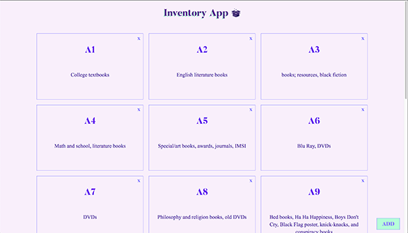

<div id="img-container">

</div>

If you've followed JavaScript trends in recent months, you've undoubtedly witnessed the meteoric rise of TypeScript.

With <a href="https://github.com/pikapkg/web" target="_blank">top</a> <a href="https://github.com/microsoft/vscode" target="_blank">open-source</a> <a href="https://github.com/angular/angular" target="_blank">projects</a> deployed or <a href="https://news.ycombinator.com/item?id=17467141" target="_blank">rewritten</a> in the language and a growing call for adoption from <a href="" target="_blank">community luminaries</a>, embracing a new, more type-conscious JavaScript seems inevitable.

For the unsure, the transition doesn't have to be grueling. I'm here to report back from having just built an inventory API in the language. In short: it's worthwhile for the value it returns and the planning it requires.

### Why TypeScript?

To be transparent, I've been skeptical of TypeScript since hearing about it in 2016. The most convincing criticism came from JavaScript thought leader Eric Elliott, who in his viral blog post dubbed <a href="https://medium.com/javascript-scene/the-typescript-tax-132ff4cb175b" target="_blank">"The TypeScript Tax"</a> argued that:

_"Type correctness does not guarantee program correctness."_

Citing several case studies of major businesses and their code bases, Elliott argues that the cost of adopting TypeScript isn't worth the benefit it brings in deflecting bugs.

After using the superset in a few recent projects, I've found that the questions it forces the developer to answer end up making the solution stronger overall. What will the data look like for this abstraction? What are its default values? What are the expectations when mutating it? All are concerns considered earlier in a TypeScript-based project.

TypeScript has also offered several workflow-related benefits. Among them include:

- better introspection, debugging, and code completion (_especially in VSCode_)
- compile-time errors caught faster
- powerful bindings to GraphQL schemas for more concise, error-averse code (<a href="https://medium.com/@pie6k/graphql-typescript-best-way-to-write-type-safe-schema-88d3c302ad19" target="_blank">example</a>)

Don't just take it from me: <a href="https://www.upwork.com/hiring/community/the-advantages-of-typescript/" target="_blank">Upwork</a>, <a href="https://www.appdynamics.com/blog/engineering/the-benefits-of-migrating-from-javascript-to-typescript/" target="_blank">AppDynamics</a>, <a href="https://ionicframework.com/docs/v3/developer-resources/typescript/">Ionic</a>, and other companies are voicing their support.

Since we've determined that TypeScript is worth considering for projects, let's look at an example of its use in one.

### Getting Started - Project Overview

For my TypeScript app, I built an inventory API to stay organized during my imminent move across Las Vegas. By labeling my boxes and writing detailed descriptions of what's in each container, I'm hoping to reduce time and stress from the usual relocation process.

You can check out the current state of the project on its <a href="https://github.com/alephnode/inventory-app" target="_blank">GitHub repository</a>, or follow along below for a walkthrough on setting up the project.

It's worth mentioning that the <a href="https://github.com/microsoft/TypeScript-Node-Starter" target="_blank">Microsoft Node Starter Kit</a> served as the inspiration for this project. Give it a glance when you have time, or if you want a more robust example involving user authentication.

First, a look at the project structure (jumping into the _/backend_ directory, that is):

```bash
.
├── README.md
├── mock
│   └── inventory.json
├── package.json
├── src
│   ├── app.ts
│   ├── controllers
│   │   ├── boxes.ts
│   │   └── home.ts
│   ├── models
│   │   └── Box.ts
│   ├── server.ts
│   ├── types
│   │   └── IBoxModel.ts
│   └── util
│       └── secrets.ts
├── tsconfig.json
├── tslint.json
└── yarn.lock
```

The two root-level files of note are _tsconfig.json_ and _tslint.json_. The former configures all TypeScript settings associated with the project, and the latter sets defaults for the linting that occurs during the TypeScript compilation process.

_tsconfig.json_:

```json
{
  "compilerOptions": {
    "module": "commonjs",
    "esModuleInterop": true,
    "target": "es6",
    "noImplicitAny": true,
    "moduleResolution": "node",
    "sourceMap": true,
    "outDir": "dist",
    "baseUrl": ".",
    "paths": {
      "*": ["node_modules/*", "src/types/*"]
    }
  },
  "include": ["src/**/*"]
}
```

For a full list of compiler options, check out the handy <a href="https://www.typescriptlang.org/docs/handbook/compiler-options.html" target="_blank">TypeScript compiler option documentation</a>.

_tslint.json_:

```json
{
  "rules": {
    "class-name": true,
    "comment-format": [true, "check-space"],
    "indent": [true, "spaces"],
    "one-line": [true, "check-open-brace", "check-whitespace"],
    "no-var-keyword": true,
    "quotemark": [true, "single", "avoid-escape"],
    "whitespace": [
      true,
      "check-branch",
      "check-decl",
      "check-operator",
      "check-module",
      "check-separator",
      "check-type"
    ],
    "typedef-whitespace": [
      true,
      {
        "call-signature": "nospace",
        "index-signature": "nospace",
        "parameter": "nospace",
        "property-declaration": "nospace",
        "variable-declaration": "nospace"
      },
      {
        "call-signature": "onespace",
        "index-signature": "onespace",
        "parameter": "onespace",
        "property-declaration": "onespace",
        "variable-declaration": "onespace"
      }
    ],
    "no-internal-module": true,
    "no-trailing-whitespace": true,
    "no-null-keyword": true,
    "prefer-const": true,
    "jsdoc-format": true
  }
}
```

For the most part, I accepted the defaults of the previously mentioned Microsoft Node Starter Kit.

Next is the mock directory, which houses data to seed into a MongoDB database. For detailed instructions, refer to <a href="https://github.com/alephnode/inventory-app" target="_blank">the project's README.md</a> (you'll need MongoDB installed to run the script).

Now would be a good time to install the dependencies we'll use in the project. To do so, we run the install command in the backend project's root directory:

```bash
yarn add body-parser compression cors dotenv express lusca mongoose nodemon tslint typescript
```

We also need to handle the types of the libraries we include. This is accomplished by installing the packages provided by each respective project.

Most libraries publish their types in a similar convention on NPM: with the @types/ prefix. For our project, we'll use those published by Lusca, Mongoose, and a few others:

Again, we run a command from the project root:

```bash
yarn add --dev @types/body-parser @types/express @types/compression @types/lusca @types/node @types/dotenv @types/mongodb
```

### Building the Interface

With config files out of the way, the next step is to model the data items used in the project. In TypeScript, it's common to define the shape of your data through an _interface_.

For my inventory app, there will only be one interface: IBoxModel.ts. Each box will have a <a href="https://www.guidgenerator.com/" target="_blank">GUID</a> and a summary of all the items in the box.

We define our interface in _src/types/IBoxModel.ts:_

```typescript
import { Document } from 'mongoose'

export default interface IBoxModel extends Document {
  box: string
  items: string
}
```

Note that we're extending the Document class from the Mongoose library since we'll eventually persist this in the NoSQL database we connect.

Since we're working with MongoDB through Mongoose, the next step is to define our schema.

_src/models/Box.ts_:

```typescript
import { Schema, model } from 'mongoose'
import IBoxModel from '../types/IBoxModel'

const BoxSchema = new Schema({
  box: String,
  items: String,
})

export default model<IBoxModel>('Box', BoxSchema, 'boxes')
```

If you've ever worked with Mongoose, the above should look familiar. In short, we're building the object representation of the data model used in the project.

### Bootstrapping the API

The next phase of the project is setting up the server logic and routes we want to make available.

To start, we'll create the _app.ts_ file that'll do most of the groundwork for the project.

_app.ts:_

```typescript
import express from 'express'
import compression from 'compression'
import bodyParser from 'body-parser'
import lusca from 'lusca'
import cors from 'cors'
import mongoose from 'mongoose'
import { MONGODB_URI } from './util/secrets'

// Controllers
import * as homeController from './controllers/home'
import * as boxController from './controllers/boxes'

// MongoDB connection
const mongoUrl = MONGODB_URI
mongoose.connect(
  mongoUrl,
  { useNewUrlParser: true }
)

const app = express()
app.set('port', process.env.PORT || 3000)
app.use(compression())
app.use(bodyParser.json())
app.use(bodyParser.urlencoded({ extended: true }))
app.use(lusca.xssProtection(true))
app.use(cors())

/**
 * Routes
 */
app.get('/', homeController.index)
app.get('/boxes', boxController.getBoxes)
app.post('/boxes', boxController.addBox)
app.put('/boxes/:id', boxController.updateBox)
app.delete('/boxes/:id', boxController.deleteBox)

export default app
```

First we import all our dependencies:

- `express`: handles web server logic
- `compression`: assists with optimizing the delivery of our API
- `body-parser`: helps with parsing request body info
- `lusca`: support with app security
- `cors`: for helping to define CORS policy
- `mongoose`: used as the ODM, or <a href="https://devcenter.heroku.com/articles/nodejs-mongoose" target="_blank">_object-data modeling_</a> library

After including our supporting libraries, we pull in the MongoDB URI environment variable from our secrets module and establish the connection. We also include our middleware for CORS policy, xss protection, compression, and other useful presets.

Finally, we hook in our controllers and connect them to our desired routes. We'll define the details of the handlers in the next section.

To launch the server, we just need to write some code that opens a socket and listens for requests. We'll define that logic in our _server.ts_ file.

_server.ts_:

```typescript
import app from './app'

/**
 * Start Express server.
 */
const server = app.listen(app.get('port'), () => {
  console.log(
    '  App is running at http://localhost:%d in %s mode',
    app.get('port'),
    app.get('env')
  )
  console.log('  Press CTRL-C to stop\n')
})

export default server
```

As you can see, we're just starting a process on the port specified in our _app.ts_ file in the previous step.

Once these two modules are set up, we're ready to jump into our controller logic.

### Wiring Up the Controllers

Although it might seem unnecessary for this project, I like to declare a home controller for my APIs. To do so, I'll just declare a simple HomeController module.

_backend/src/controllers/home.ts:_

```typescript
import { Request, Response } from 'express'

/**
 * GET /
 * Base route
 */
export const index = (req: Request, res: Response) =>
  res.send('Inventory API - sward move June 2019 🌲')
```

A controller declared using TypeScript is practically identical to one in vanilla JS, with the exception that the request and response parameters are bound to the respective types exposed by Express's types library.

With our first controller out of the way, let's dig into the main logic involved in the app: the boxes for in my storage unit.

_backend/src/controllers/home.ts:_

```typescript
import { Request, Response } from 'express'
import Box from '../models/Box'
import IBoxModel from '../types/IBoxModel'

const stripLetters = (w: String) => parseInt(w.replace(/\D/g, ''))

export const getBoxes = (_1: Request, res: Response) =>
  Box.find((err: Error, doc: IBoxModel[]) =>
    res.send(
      doc.sort(
        (a: IBoxModel, b: IBoxModel) =>
          stripLetters(a.box) - stripLetters(b.box)
      )
    )
  )

export const addBox = (req: Request, res: Response) => {
  const newBox = new Box(req.body)
  return newBox.save((err: Error, doc: IBoxModel) => res.send(doc))
}

export const updateBox = (req: Request, res: Response) =>
  Box.findByIdAndUpdate(
    <String>req.params.id,
    { $set: req.body },
    (err: Error) => res.send(err ? err : {})
  )

export const deleteBox = (req: Request, res: Response) =>
  Box.findByIdAndRemove(<String>req.params.id, (err: Error) =>
    res.send(err ? err : {})
  )
```

First, I declare a utility function I'll use to help sort the boxes returned (my boxes are named alphanumerically because I'm a nerd). Next, I write the actual handlers that'll process the requests for the API.

Notice I'm still typing my requests and responses to the types exposed by Express's library. I'm also pulling in the interface I defined earlier to declare the type of data being returned in the JSON response: an array of boxes.

After our controller logic is defined and referenced in our entry file, the API is ready to build. Assuming yo have the compiler installed globally using `tsc`, go ahead and run the npm script provided to build the project:

```bash
yarn build
```

If everything goes well, you should have a compiled project ready for deployment. To verify, go ahead and run:

```bash
yarn start
```

If everything worked out, the API should be live on http://localhost:8811.

You can also spin up the frontend I attached to the project using the same command in the _frontend/_ directory (be warned; as of this writing it's still a WIP).

<div id="img-container">

</div>

### Conclusion

Congrats! If you made it this far, you should have a barebones functioning inventory API written with TypeScript.

As I mentioned earlier, TypeScript enhanced the clarity of my API throughout the development process. Incorrect object property references were caught immediately, and exported module methods and functions were displayed in my editor inline.

If you'd like to learn more about TypeScript-focused projects, check out the following resources:

- <a href="https://github.com/microsoft/TypeScript-Node-Starter" target="_blank">Microsoft Node Starter Kit</a>
- <a href="https://stenciljs.com/" target="_blank">StencilJS, a cool library for building design systems in TypeScript</a>
- <a href="https://www.typescriptlang.org/docs/handbook/typescript-in-5-minutes.html" target="_blank">TypeScript in 5 Minutes by the TS team</a>

As always, thanks for reading.
