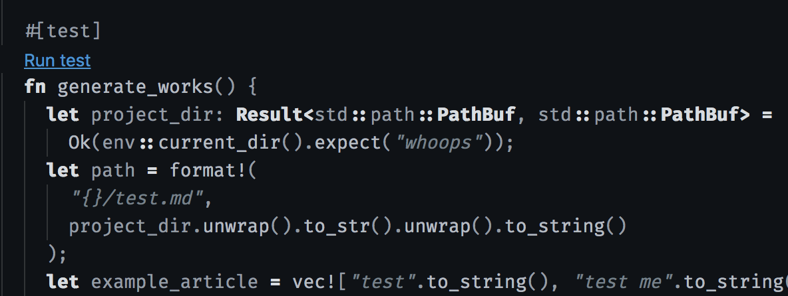

It's considered sage advice by many a developer: learn a new programming language each year.

The adage is most commonly attributed to the seminal work <a href="https://www.amazon.com/Pragmatic-Programmer-Journeyman-Master/dp/020161622X" target="_blank">The Pragmatic Programmer</a>, but it seems impossible to avoid during each year's end.

I don't formally adhere to this directive, but I _do_ see the value in its intent. Tinkering with new libraries, languages, and/or tooling often helps me gather new practices and patterns I was less likely to encounter in my existing process. It's good to explore outside your workflow from time to time. 

What's filled that time most recently is Rust. I'm intrigued specifically by its extensive use cases, performance benefits, and influence over the web's future through its adoption by the web assembly crowd. 

# Why Rust?

For the unfamiliar, Rust is a compiled, system programming language that emphasizes speed and memory security. Its key pitch is a notion of _empowerment_, or enabling developers to code with confidence in their implementations. It's also been tirelessly touted as the <a href="https://stackoverflow.blog/2019/04/09/the-2019-stack-overflow-developer-survey-results-are-in/" target="_blank">most enjoyable language to write</a>, and it's being adopted by companies like Mozilla, Cloudflare, and Atlassian. 

Microsoft has even spent months experimenting with low-level system rewrites with the language, which they've <a href="https://msrc-blog.microsoft.com/2019/11/07/using-rust-in-windows/" target="_blank">deemed to be going "mostly positive"</a>. 

Finally, it's being used to optimize performance and experiences over the web through its potential compilation to web assembly. 

Alright, enough pitching. Let's dig into the language and build something.

After mulling my personal backlog for a bit, I've decided a simple blog page scaffolder will suffice. It seems like a reasonable choice; building a file-generating program involves many things, including: 

- work with different data types 
- handle IO operations
- write to a file
- have a project structure with +1 module
- write tests
- wire it to the cli

_Before we get started: Yes, I know this could be a two-line bash script. (I know because I wrote one to verify this point.) Still, I'd rather learn Rust 😏🦀, and I like the idea of never copy-pasting a previous blog article's first 7 lines into a new markdown file ever again._

If you prefer the path of self discovery, here's the <a href="https://github.com/alephnode/rust-sandbox/tree/master/generate_blog_template" target="_blank">link to the GitHub repo</a> for this project.

Also, if you haven't already done so, install the Rust compiler and package manager by following the instructions in the <a href="https://doc.rust-lang.org/book/title-page.html" target="_blank">Rustlang documentation.</a>

Alright, let's dive in.

# Scaffolding the Project

The final tree structure for the project looks like this:

```
.
├── Cargo.lock
├── Cargo.toml
├── README.md
└── src
    ├── main.rs
    ├── reader.rs
    └── template.rs
```

Most of these files were generated from the `cargo new <project>` command (recall that Cargo is the package manager for Rust). If you want, give it a shot on your local machine to explore the project it creates.

The `cargo.lock` file helps Cargo manage dependencies and versions. The `cargo.toml` file is where packages used and other instructions for Cargo are defined, as well as metadata about the project.

Next, let's take a look at `main.rs`. This is the file that Cargo assumes is the entry point for our Rust application. Examining this file often provides a general overview of a program's workflow.

_main.rs_:

```rust
mod reader;
mod template;

fn main() {
    let template_info = reader::handle_input();
    template::generate(template_info);
}
```

First, we bring two modules into scope: reader and template. We'll dig into those files in a moment.

In `main`, we store the result of a `handle_input` function from the reader module in a template (judging from the variable name). Next, we generate a template, passing the template info to the necessary builder. Looks easy enough.

For better context, let's step into some of the functions called.

# Reading User Input: Module One

Here's our first stop: the reader module.

_reader.rs_:

```rust
use std::io;

pub fn handle_input() -> Vec<String> {
  let article_name = String::from(get_file_name());
  let article_title = String::from(get_article_title());
  let mut res = confirm(&article_name, &article_title);

  res.pop();
  while res != "y" {
    return handle_input();
  }
  vec![article_name, article_title]
}

fn get_file_name() -> String {
  println!("\nName of file: ");

  format_name(read_input(), true)
}

fn get_article_title() -> String {
  println!("\nName of the blog title: ");

  format_name(read_input(), false)
}

fn confirm(article_name: &str, article_title: &str) -> String {
  println!("\nArticle Name You Typed: {}", article_name);
  println!("\nArticle Title You Typed: {}", article_title);
  println!("\nConfirm: y/N:  ");

  read_input()
}

fn read_input() -> String {
  let mut response = String::new();

  io::stdin()
    .read_line(&mut response)
    .expect("Failed to read line");

  response
}

fn format_name(mut name: String, strip: bool) -> String {
  name.pop();
  if strip {
    name = name.replace(" ", "-");
  }
  name
}

#[cfg(test)]
mod tests {
  use super::*;

  #[test]
  fn format_name_works() {
    assert_eq!("war", format_name(String::from("ward"), false));
    assert_eq!(
      "this-should-have-no-spaces",
      format_name(String::from("this should have no spaces\n"), true)
    );
    assert_eq!(
      "this should have spaces",
      format_name(String::from("this should have spaces\n"), false)
    )
  }
}
```

There's considerably more going on in this file 😰. Fear not, brave Rustaceans: all can be explained.

In short, this file is implementing the functionality for reading user input. 

At the top we bring all libraries used into scope. In this case, I'm leaning on the standard library's IO interface. 

Next we find the only public function in this module: `handle_input`, which was referenced in the `main.rs` file earlier. 

Because Rust is a statically typed language, the intention and flow of functions are often expressed in their signatures. `handle_input`'s looks like this:

```rust
pub fn handle_input() -> Vec<String>
```

We can see the function takes no input and returns an array of string values back to the caller. 

Now for the body:

```rust
  let article_name = String::from(get_file_name());
  let article_title = String::from(get_article_title());
  let mut res = confirm(&article_name, &article_title);

  res.pop();
  while res != "y" {
    return handle_input();
  }
  vec![article_name, article_title]
```

We see it calls some internal functions and stores their result in variables named after the info collected. It also does this recursively until we receive confirmation from the user that the input is valid. Note that the `pop()` on my `res` variable is to remove the newline (\n) character for easy comparison on the next line. Yeah, Rust is that low-level :)

If you step further into the file, you'll see the actual IO handling implementation:

```rust
  io::stdin()
    .read_line(&mut response)
    .expect("Failed to read line");
```

One of the more impressive features I discovered with Rust was its Result type, which is returned from a function that suspects a recoverable error could happen. Such is the case in the example above with `read_line` from Rust's standard lib. In addition to calling the function to grab user input, I appended an exception handler (`except`) in case the operation failed.  

Because this was my first real foray into Rust territory, there are a few additional syntax-related points to call out in this file:

- functions return implicitly when an expression ends without a semicolon
- by default, variables are immutable in Rust. This is how the language enforces type safety
- Because there's no runtime (!), Rust relies on a concept of _ownership_ to handle variables falling out of scope. This is considerably different from JavaScript and other languages, and it was the biggest hurdle to get passed when learning. In short, once a variable is assigned to another variable or passed to a function, it no longer holds the value it once did. This is why you see the ampersand used in some parts of the code examples; I'm passing variables to functions by _reference_ so that their value isn't lost.

# Writing Tests

By now, the austere, wise developer in you should be asking an important question: _where are the tests for these modules?_

Worry not, astute reader; this project is covered in them, they're just easy to miss.

You see, in something that has taken a bit of getting used to, unit tests are kept in the same file as the source code in Rust. I guess scrolling isn't considered a DX downside in systems programming :)

Joking aside, you can return to the previous `reader.rs` module above and see the tests defined beneath the `#[cfg(test)]` attribute:

_reader.rs_:

```rust
#[cfg(test)]
mod tests {
  use super::*;

  #[test]
  fn format_name_works() {
    assert_eq!("war", format_name(String::from("ward"), false));
    assert_eq!(
      "this-should-have-no-spaces",
      format_name(String::from("this should have no spaces\n"), true)
    );
    assert_eq!(
      "this should have spaces",
      format_name(String::from("this should have spaces\n"), false)
    )
  }
}
```

Ah, we haven't discussed attributes yet. In short, they're metadata that provide special instructions to the compiler. In this context, it's telling the compiler to treat the resulting lines as test functions (which they are).

Another call-out would be the `use super::*` statement. Because tests are inside a separate, inner module within the file, it requires us to bring the code from the outer module into the test module. The wildcard ensures we catch everything and bring it in. The rest of the code is basic assertion boilerplate.

To run the tests, simply bang this into the command line: 

```bash
cargo test
```

If you're working in VSCode, I noticed a sweet tooltip to run the tests from the file itself:

<div id="img-container">

</div>

And with that, we have functioning tests. 

Oh, yeah—something I do when writing Rust is occasionally verify my code's still compiling. Let's do that now while we're still young:

```bash
cargo check
```

Phew, we're good. (At least you _better_ be. Go ahead and double-check your work or refer to the repo if it's not compiling for you.)

Alright, on to the second half of this service: actually _creating_ the blog template.

# Creating the Blog Template: Module Two

Below lies the contents of my template module.

_src/template.rs:_

```rust
extern crate chrono;
use chrono::{DateTime, Utc};
use std::fs;
use std::io::prelude::*;

pub fn generate(article_info: Vec<String>) {
  let name = &article_info[0];
  let title = &article_info[1];
  println!("Got it. Generating template now ...");
  create_file(&name, &title).expect("Issue generating template.");
}

fn create_file(name: &str, title: &str) -> std::io::Result<()> {
  let filename = format!("{}.md", name);
  let now: DateTime<Utc> = Utc::now();
  let mut file = fs::File::create(filename)?;
  file.write_all(
    format!(
      "
  ---
  title: {}
  date: {}
  ---
  ",
      title,
      now.format("%b %e %Y")
    )
    .as_bytes(),
  )?;
  Ok(())
}

#[cfg(test)]
mod tests {
  use super::*;
  use std::env;

  #[test]
  fn generate_works() {
    let project_dir: Result<std::path::PathBuf, std::path::PathBuf> =
      Ok(env::current_dir().expect("whoops"));
    let path = format!(
      "{}/test.md",
      project_dir.unwrap().to_str().unwrap().to_string()
    );
    let example_article = vec!["test".to_string(), "test me".to_string()];
    assert_eq!((), generate(example_article));
    assert_eq!(true, fs::metadata(path).is_ok());
  }
}
```

The sole purpose of this file, as its name suggests, is to generate the blog file based on the input provided in the previous step.

At the top of the module is the first example of how to import an *external* library into the project. In this case, we're bringing in chrono, a Rust lib for handling time formats. We also bring a few of its classes into scope through the `use` keyword. 

To wrap up the include statements, we pull in the filesystem class from the standard library. The last line is a bit different from the other files in that we're telling the compiler to prelude, or prefix everything, with a specific namespace. This makes it so we don't have to explicitly write it out with each function called. 

Anyhow, into the guts of the module. The publicly exposed function just extracts the template info passed in and calls a private `generate` function to handle the job. 

In that function, we perform the following tasks:
- create the dynamic filename based on user input
- actually *create* the file
- write the necessary data into the file

As with the previous section, there are a few syntax-related points to make in this section.

<points, including test section unwrapping>

With this module complete, we should have a fully functioning Rust application that creates a file based on input. Give it a try yourself:

```bash
cargo run
```

If it worked, you should see a new file in your directory like moi: 

<div id="img-container">

</div>

# Final Step: Creating a CLI Command

_Note: the following section assumes you're running on a Mac.

Finally, let's write a bash script and drop it in the user directory so we can execute this program with a sweet alias like `create-blog-page <args>`

Start by navigating to your `/usr/local/bin` directory. Create a file, naming it what you'd like the command to be (so no file extension). An example would be `create-blog-page` like I did above.

The file contents should look like this:

_/usr/local/bin/create-blog-page:_

```
#!/bin/bash
cd ~/<path-to-rust-project>
cargo run
```

When you're finished, give the file the permissions necessary to run: `chmod 755 create-blog-page`

You should now be able to run the command and see the program kick off!

<TODO screenshot of terminal running rust command>

# What Lies Ahead

Look out for an article about Web Assembly and Rust in the near future. Until then, here are a few resources I found helpful throughout my journey:

- <a href="https://doc.rust-lang.org/1.30.0/book/2018-edition/index.html" target="_blank">Official Rust Language Book</a>. This thing _slays_>
- <a href="https://rustwasm.github.io/book/" target="_blank">Rust Web Assembly Book</a>
- <a href="https://github.com/timvisee/ffsend" target="_blank">ffsend</a> (Firefox send client)
- <a href="https://github.com/jwilm/alacritty" target="_blank">Alacritty</a> (terminal written in Rust)
- <a href="https://github.com/Rigellute/spotify-tui" target="_blank">Spotify TUI</a> (Spotify app that runs in terminal written in Rust 🤤)

As always, thanks for reading!