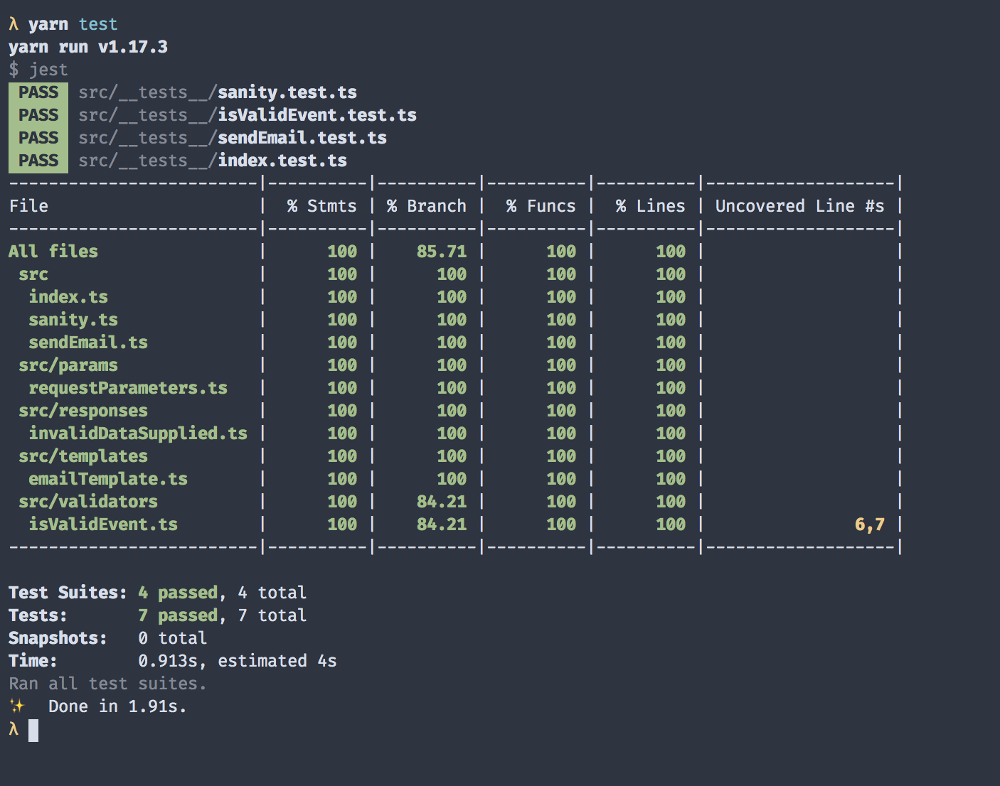

<div id="img-container">

</div

A few months have passed since my last article. During that time, I've been tending to a new home, new role, and new workload.

You see, I've had to shift my gaze upon the endless vista that is the JavaScript ecosystem. Whereas the brunt of last year's work involved front-end concerns like rendering virtual lists and optimizing bundle performance, my time lately has been spent supporting JavaScript-based microservices at scale.

As a result, the next few articles will reflect the resulting learnings and investigations.

At the core of my professional growth is the single-most beneficial change I've made: adhering to a Test-Driven Development (or TDD) pattern.

I know what you're thinking: I'm one of those assholes who writes about obvious best practices that'll look good on my resume.

And, to level with you, that's the world I wish we _actually_ lived in. I relish the thought of stating the obvious when discussing thorough testing and the modular, cohesive code that derives from it.

Instead, we often inherit code that has sparse—if _any_—test coverage. Even if there are tests, they're not wired to a CI/CD pipeline that defends your builds from buggy code.

So I have to be the guy who writes about test-driven development (which will look good on my resume).

For the sake of keeping things concentrated (and the article length outside of think-piece territory), I'll publish a testing-themed walkthrough in two parts. The first, this one, aims to achieve two goals:

1. explain the rationale for TDD, and
2. highlight the formidable strength of Jest, a JavaScript framework that makes the DX for testing painless.

The second will focus on creating a CI/CD layer that leverages our tests to reject breaking changes and deploy successful code once merged. It'll also detail how to update infrastructure automatically through Terraform.

But let's not get ahead of ourselves. Here's why we need tests in the first place.

### Why TDD?

Instead of using the results-first flow of previous articles, we're going to build a project incrementally with tests that explain what we'd like to accomplish. We'll then implement logic that gets the tests to pass.

To many, this is the heart of TDD. It's also a commendable philosophy to practice, and nearly essential when taking on legacy code bases.

There are several reasons why this is the case. For one, writing tests forces the engineer to consider edge cases and function boundaries prior to implementation.

Another benefit is that, when describing _how_ to do something instead of _actually_ doing it, you're less likely to get entangled in busy functions that try to do more than one thing or are tightly coupled (keep it SOLID, people).

Finally, _leading_ with tests is beneficial since it's more difficult and time-consuming to write them afterward. Tests also tend to get nixed in planning sessions for the sake of delivering more features.

If we follow this methodology and write meaningful, thorough tests, we can use them to protect our code by running them whenever pull requests are opened or during deployment pipelines. This is invaluable for anyone who's ever open-sourced a project or worked on a project with more than a few people.

### A Practical Approach: What We're Building

For the sake of this article, I'm going to focus on writing meaningful unit tests to show off common testing practices. To do this, I'll use Jest, a popular JavaScript testing framework. There are quite a few nifty features that come stock with the library, including:

- coverage reports
- built-in assertions
- automatic mocking

and other niceties. I'll be sure to point them out as we go along.

It's worth noting that there's been discussion in the community about the right formula for testing applications. The conventional wisdom was to aim for a <a href="https://martinfowler.com/bliki/TestPyramid.html" target="_blank">pyramid-style</a> methodology, where unit testing is the most abundant type of tests available for the service, followed by component and integration tests and finally reaching end-to-end (E2E) tests at the top.

Another model would be the venerable Kent C. Dodds' testing trophy. In short, the mantra is:

<a href="https://kentcdodds.com/blog/write-tests" target="_blank">Write tests. Not too many. Mostly integration.</a>

According to his heuristic, there's a diminishing return in stability after reaching a certain point (70 percent, for example).

Whichever you choose, what's important is that it increases your shipping confidence. As long as the project is reliable, scalable, and maintainable, build out any model that is successful for your project or team.

For me, I feel uneasy taking on legacy code bases with anything less than 90 percent coverage, at least until I'm familiar with the system. I'm sure other developers feel the same, which leads me to believe that poor coverage might impact a team's ability to attract talent. Food for thought!

Anyway, this brings us to the example project. In short, it's a simple script that sends an email using Amazon's Simple Email Service (SES). The deploy target is a lambda function. I'll explain more on the infrastructure in the follow-up article, which will focus on Jenkins and Terraform for CI/CD and infrastructure as code (IaC) examples, respectively.

Alright, let's jump in.

### High-Level Project Overview

Before we start, have a look at the tree structure for the project:

```
.
├── Jenkinsfile
├── README.md
├── deploy.sh
├── jest.config.js
├── package.json
├── src
│   ├── __mocks__
│   │   ├── aws-sdk.ts
│   │   └── mockAWSResponse.ts
│   ├── __tests__
│   │   ├── index.test.ts
│   │   ├── isValidEvent.test.ts
│   │   ├── sanity.test.ts
│   │   └── sendEmail.test.ts
│   ├── index.ts
│   ├── params
│   │   └── requestParameters.ts
│   ├── responses
│   │   └── invalidDataSupplied.ts
│   ├── sanity.ts
│   ├── sendEmail.ts
│   ├── templates
│   │   └── emailTemplate.ts
│   └── validators
│       └── isValidEvent.ts
├── tsconfig.json
└── yarn.lock
```

Let's also inspect the _package.json_ file to see what's installed:

```json
{
  "name": "email-lambda",
  "version": "1.0.1",
  "description": "",
  "main": "dist/index.js",
  "dependencies": {
    "aws-sdk": "^2.601.0"
  },
  "scripts": {
    "test": "jest -i",
    "build": "tsc",
    "deploy": "./deploy.sh"
  },
  "keywords": [],
  "author": "",
  "license": "ISC",
  "devDependencies": {
    "@types/aws-lambda": "^8.10.39",
    "@types/jest": "^24.0.18",
    "@types/node": "^12.6.9",
    "jest": "^24.9.0",
    "ts-jest": "^24.0.2",
    "ts-node": "^8.3.0",
    "typescript": "^3.5.3"
  }
}
```

Not much to include with this project aside from the AWS SDK, Jest, TypeScript necessities, and project-specific utilities (config presets and the types for our external libraries).

It's worth popping open _jest.config.js_ to see how we're configuring Jest to behave.

_jest.config.js_:

```javascript
module.exports = {
  preset: 'ts-jest',
  testEnvironment: 'node',
  roots: ['src', 'dist'],
  collectCoverage: true,
}
```

I'm including a preset for Jest so it knows I'm using TypeScript, and also specifying my root directories and test environment. For more info on configuring Jest, check out the project's thorough <a href="https://jestjs.io/docs/en/configuration" target="_blank">documentation</a>.

### Getting Started: Tests First

Let's create our first test file. Because this project involves compilation steps, test suite configuration, a CI/CD layer, and deployment scripts, there's quite a bit that could go wrong from development to release. For this reason, I generally include a canary endpoint/module in these types of projects that serves as a base case. I name these files _sanity.\*_ because, as the name implies, they exist solely for me to troubleshoot base integrations if anything goes awry.

Implementing my canary module will start with a test. Because the purpose is for the file to be simple, I'll assert that the sanity module returns a simple "Hello, World!" response.

_src/\__tests__/sanity.test.ts_:

```typescript
import { handler, SanityResponse } from '../sanity'

describe('Sanity tests', () => {
  it('passes canary', () => expect(true).toBe(true))
  it('responds with expected string', () =>
    handler(null, null, (_1, res: SanityResponse) =>
      expect(res.body).toEqual('Hello World!')
    ))
})
```

Because this project will be an AWS lambda function, I'll follow its respective handler signature pattern to test the service. In doing so, it'll accept three arguments:

- <strong>event</strong>, which pertains metadata about the invoker
- <strong>context</strong>, where all the information and details about the invocation are located
- <strong>callback</strong>, which follows the traditional Node callback pattern of `error` and `success` (or in this case `response`).

For more detailed info on lambda functions, head over to their <a href="https://docs.aws.amazon.com/lambda/latest/dg/nodejs-handler.html" target="_blank">documentation</a>.

Note that Jest provides test-running methods as well as assertion functions out of the gate. This is our first example of the convenience it provides. This will appeal to those who don't want to import a module at the top or download a separate library for test assertions (I'm looking at you, `mocha` and `chai` workflow).

OK, let's implement this simple case and make the test pass. In order to do so, I'll need to export a function called `handler` that follows the lambda signature used above.

_src/sanity.ts_:

```typescript
import { Handler, Context, Callback } from 'aws-lambda'

interface SanityResponse {
  statusCode: number
  body: string
}

const handler: Handler = (event, context: Context, cb: Callback) => {
  const response: SanityResponse = {
    statusCode: 200,
    body: 'Hello World!',
  }

  cb(null, response)
}

export { handler, SanityResponse }
```

The exported function in this module returns a response body with the payload expected in our test. 

Alright, onto our project logic.

In order for this lambda to run, we'll have to implement an _actual_ handler for it. Let's start with writing the test file for this module, explaining what we want it to do:

- respond with the expected response when a valid request is provided, and
- send an error message when our payload is incorrect.

_src/\__tests__/index.test.ts_:

```typescript
import { handler } from '../index'
import { invalidDataSupplied } from '../responses/invalidDataSupplied'

describe('Index tests', () => {
  it('responds with expected string with valid params', async () => {
    const res = await handler(
      {
        details: {
          emailAddress: 'example@mysite.com',
          message: 'time to get this bread',
        },
      },
      null,
      null
    )
    expect(res).toBeTruthy()
  })
  it('responds with error with valid params', async () => {
    const res = await handler({ details: { message: 'hello' } }, null, null)
    expect(res).toEqual(invalidDataSupplied)
  })
})
```

Again, we use some Jest-specific functions for describing our tests, breaking them into separate units, and asserting the value of the functions we're testing. One thing to note is that each test written can be expressed as having three distinct sections:

- <strong>arranging </strong>the data and functions needed
- <strong>acting</strong>, or performing the operation being tested, and
- <strong>asserting</strong> the expected value or effect of the operation

This is considered the AAA pattern and is common in the TDD community. Check out an <a href="https://docs.microsoft.com/en-us/visualstudio/test/unit-test-basics?view=vs-2019" target="_blank">exploration of the concept</a> if you're curious.

Inspecting the file, we're simply passing test message events into the handler. When we encounter invalid data, we ensure the response matches our canned invalid data message.

_src/responses/index.test.ts_:

```typescript
export const invalidDataSupplied = {
  status: 400,
  message: 'Invalid Data Supplied.',
}
```

For the canned response, we set the proper status code and provide a human-readable message back to the user.

Before implementing our root handler, the test presents us with another module that we'll need prior to calling SES: a validation check.

Let's go ahead and write out what we'd expect that validation layer to do for us.

_src/\__tests__/isValidEvent.test.ts_:

```typescript
import { isValidEvent } from '../validators/isValidEvent'

describe('isValidEvent tests', () => {
  it('responds truthy for valid payload', async () => {
    const res = isValidEvent({
      details: { emailAddress: 'test@me.com', message: 'hello' },
    })
    expect(res).toEqual(true)
  })
  it('response false with invalid payload', async () => {
    // @ts-ignore
    const res = isValidEvent({ foo: 'bar' })
    expect(res).toEqual(false)
  })
})
```

As expected, we pass and fail based on whether the payload passed in matches the shape we expect.

I know this test might seem tedious, but it makes it so you can trust the shape of the data you're processing after a certain step in the application. It also helps identify when your API request contract changes and fails if not updated. Good stuff!

Onto the implementation of this validator function:

_src/validators/isValidEvent.ts_:

```typescript
import { EmailEvent } from '../index'

export const isValidEvent = (evt: EmailEvent): boolean =>
  Boolean(
    typeof evt === 'object' &&
      evt?.details?.emailAddress &&
      evt?.details?.message
  )
```

We pass the payload received to the validator and ensure it has the data necessary to eventually send the email.

Note: if you're unfamiliar with the `?.` syntax above, it's a convenient new feature called <strong>optional chaining</strong>. Read more about it <a href="https://developer.mozilla.org/en-US/docs/Web/JavaScript/Reference/Operators/Optional_chaining" target="_blank">here</a>.

Alright, I'd say we're ready to work on that root handler now.

_src/index.ts:_

```typescript
import { Handler } from 'aws-lambda'
import { sendEmail } from './sendEmail'
import { isValidEvent } from './validators/isValidEvent'
import { invalidDataSupplied } from './responses/invalidDataSupplied'

type EmailEvent = {
  details: {
    emailAddress: string
    message: string
  }
}

const handler: Handler = async (event: EmailEvent) => {
  if (!isValidEvent(event)) return invalidDataSupplied
  const params = event.details
  return await sendEmail(params)
}

export { handler, EmailEvent }
```

We see the handler performing two main operations:

1. validating the request, and
2. sending the email

If your eye is keen, you'll see that I called a `sendEmail()` function that we didn't write yet. Let's fix that.

Not to derail our progress, we'll work on the test file first. This helps us express what we'd _like_ the function to do before coding it out.

_src/\__tests__/sendEmail.test.ts:_

```typescript
import { sendEmail } from '../sendEmail'
import expectedResponse from '../__mocks__/mockAWSResponse'

describe('Index tests', () => {
  it('responds with expected string with valid params', async () => {
    const res = await sendEmail({
      emailAddress: 'test@me.com',
      message: 'hello',
    })
    expect(res).toStrictEqual(expectedResponse)
  })
})
```

In the test, we invoke the `sendEmail` function, which reaches out to SES and sends an email to the recipient passed. We then compare the result with the predefined response we expect back.

How did we supposedly call the SES service and know what the response would be in advance? As it turns out, this project is leveraging another cool feature of Jest: path-based mocking conventions. Because I created a file named `aws-sdk` within a `__mocks__` folder in the `src` directory, I was able to mock the response of the library when running tests. Now, instead of calling the SES service on each test run, Jest will _mock_ the response with the one provided. Let's peek into the file for a better understanding.

_src/\__mocks__/aws-sdk.ts:_

```typescript
import mockAWSResponse from './mockAWSResponse'

export const config = {
  update: jest.fn(),
}

export const SES = jest.fn(() => ({
  sendEmail: jest.fn().mockReturnValue({
    promise: () => Promise.resolve(mockAWSResponse),
  }),
}))
```

Here we see that we're telling the SES's `sendEmail()` function to send our mock AWS response. Let's dig into that file to see what that response looks like.

_src/\__mocks__/mockAWSResonpse.ts:_

```typescript
export default {
  ResponseMetadata: {
    RequestId: 'd351fa09-5192-4ea2-9b7f-4e94aad9d856',
  },
  MessageId: '010001719039e90c-fdd18192-a7e5-4ac0-8e65-c929859181f8-000000',
}
```

That looks like a typical SES response. Alright, enough suspense. Time for the _actual_ implementation.

_src/sendEmail.ts:_

```typescript
import * as aws from 'aws-sdk'
import { requestParameters } from './params/requestParameters'

export const sendEmail = async () => {
  aws.config.update({ region: 'us-east-1' })

  const ses = new aws.SES()

  const res = await ses.sendEmail(requestParameters).promise()

  return res
}
```

As expected, the module uses the AWS sdk to send an email using the SES service and returns the response.

Now that we've seen the core logic of the application, it's time to run the tests we saw earlier. If everything goes well, they should all pass.

<div id="img-container">

</div

Hooray! We've now successfully written tests to describe our desired functionality. We then added features by coding until those tests passed. If you ask me, this exercise gave us a taste of the zen-inducing flavor of TDD that helps keep code explicit and maintainable.

### Wrapping Up

By now, we've written a few tests that show how to mock, assert, and perform other essential methods for testing our code.

In part two of this article, I'll show how to deploy the service using infrastructure as code with Terraform, as well as setting up a CI/CD system with Jenkins.

For now, here's the usual reading list for more information.

- <a href="https://pragprog.com/book/vsjavas/test-driving-javascript-applications" target="_blank">Pragmatic Bookshelf's "Test-Driving JavaScript Applications"</a> (examples are a bit outdated, but the concepts are sound)
- <a href="https://testingjavascript.com/" target="_blank">Kent Dodd's Testing JavaScript course</a>
- <a href="https://github.com/testophobia/testophobia" target="_blank">Testophobia</a>, a web snapshot testing library I built with a former coworker.

As always, thanks for reading.
