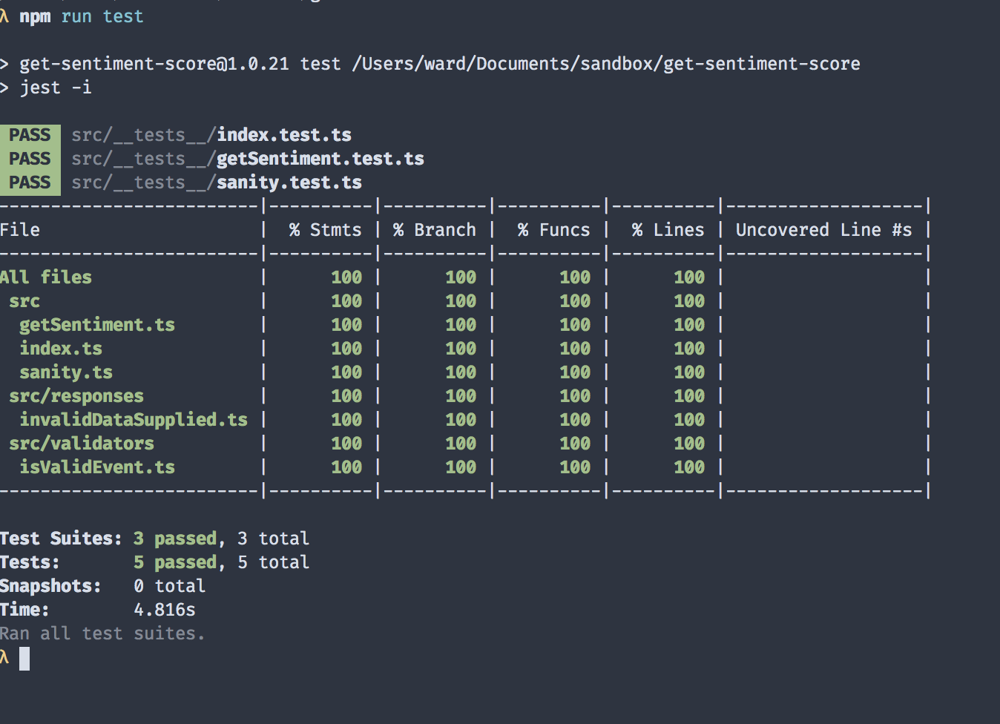

A well-defined, well-designed, and well-executed application is worthless if it's not maintainable.

I write this not from my hike down Mount Sinai, but rather from the "Recovery Room of Projects Past", where features scaled too quickly and product owners traded upfront cost for maintenance cost.

Said a different way, I've _seen_ some shit. From startups to Fortune-ranked companies, I've witnessed efficient continuous deployment strategies as well as shameless copy/paste-across-virtual-server-UI-display jobs. These experiences have taught me how fruitful build processes can be. Now that I've seen the light, there's no going back.

### The Quest to Optimize Software Delivery Performance

On the subject of efficient workflows, Google has an entire team of engineers dedicated to maintaining and optimizing the delivery of software. They're called SREs (site reliability engineers), and their noble work is outlined in an <a href="https://landing.google.com/sre/sre-book/toc/index.html" target="_blank">O'Reilly book on the subject</a> (also linked at the end).

One of the key takeaways from the text is the team's insistence on reducing "toil" among its engineers. The term is defined as:

_"...work tied to running a production service that tends to be manual, repetitive, automatable, tactical, devoid of enduring value, and that scales linearly as a service grows."_

Google isn't the only team interested in efficiencies. In 2018, a group of researchers and industry professionals published the polemical work "Accelerate: The Science of Lean Software and DevOps: Building and Scaling High Performing Technology Organizations" that outlined how software companies can optimize delivery performance.

In short, the research identified several important practices of successful engineering teams:

- building quality in
- having frequent releases and short-lived branches
- automating repetitive tasks
- implementing infrastructure as code (checked into version control)
- constantly running tests and enforcing coverage

While we could probably identify several viable implementations of the items in this list, one idea comes to mind that would quickly satisfy them all: a CI/CD workflow, of course!

_Note: I'm assuming readers are aware of what "CI/CD" (continuous integration, continuous delivery) entails. If you're unfamiliar with the term, here's a <a href="https://stackify.com/what-is-cicd-whats-important-and-how-to-get-it-right/" target="_blank">brief overview</a> of the topic._

Among other things, a CI/CD layer will serve as a quality guard that runs tests and handles the deployment/infrastructure of our services, all triggered by events we define (usually a push to a branch in version control). If set up correctly, the manual toil of many QA steps and deployment script runs disappear altogether.

For some process-malnourished teams, continuous integration pipelines will nudge the group to have a suite of tests to run in the first place. That way, there's criteria for what should _pass_ or _fail_ in a given build.

This is something you want. More code coverage means more lines being tested, which catches regressions faster than the manual testing you'd otherwise have to do. This is also something experienced developers know to ask about when considering joining a new team, so it's worth keeping your services in proper shape to attract talent.

### Creating a Personal Build Server

Now that we've decided to create a CI/CD pipeline, it's time to select one of the options available for implementing one. The good news is that most offerings have edged closer to feature parity over the years. Among the top solutions include:

- <a href="https://circleci.com/" target="_blank">CircleCI</a>
- <a href="https://travis-ci.com/" target="_blank">Travis</a>
- <a href="https://buddy.works/" target="_blank">Buddy</a>

Although I'd probably select CircleCI if it were my project to own, none dominate the market like <a href="https://jenkins.io/" target="_blank">Jenkins</a>. Since it's a technology the average developer will undoubtedly run into at work, it thus deserves a good understanding.

To better show the flow of the CI/CD pipeline, I built a quick Node-based service that uses <a href="https://aws.amazon.com/comprehend/" target="_blank">AWS Comprehend</a> to perform sentiment analysis on my personal journal entries. If you'd like to follow along, you'll need an <a href="https://aws.amazon.com/premiumsupport/knowledge-center/create-and-activate-aws-account/" target="_blank">AWS account</a>. Also note that you'll have to destroy all resources you created during the tutorial, otherwise you'll be charged for them. Don't worry: there's a section on that at the end 🧙.

Alright, let's jump into the project.

### High-Level Project Overview

Before we start, have a look at the tree structure for the project:

```
.
├── Jenkinsfile
├── README.md
├── deploy.sh
├── jest.config.js
├── package.json
├── src
│   ├── __mocks__
│   │   ├── aws-sdk.ts
│   │   └── mockAWSResponse.ts
│   ├── __tests__
│   │   ├── getSentiment.test.ts
│   │   ├── index.test.ts
│   │   └── sanity.test.ts
│   ├── getSentiment.ts
│   ├── index.ts
│   ├── responses
│   │   └── invalidDataSupplied.ts
│   ├── sanity.ts
│   └── validators
│       └── isValidEvent.ts
├── tsconfig.json
└── yarn.lock
```

Let's also inspect the _package.json_ file to see what's installed:

```json
{
  "name": "get-sentiment-score",
  "version": "1.0.21",
  "description": "",
  "main": "dist/index.js",
  "dependencies": {
    "aws-sdk": "^2.601.0",
    "nodemon": "^1.19.4"
  },
  "scripts": {
    "test": "jest -i",
    "build": "tsc",
    "start": "npx nodemon --watch 'src/**/*' --exec 'ts-node' src/index.ts",
    "deploy": "./deploy.sh"
  },
  "keywords": [],
  "author": "",
  "license": "ISC",
  "devDependencies": {
    "@types/aws-lambda": "^8.10.39",
    "@types/jest": "^24.0.18",
    "@types/node": "^12.6.9",
    "jest": "^24.9.0",
    "ts-jest": "^24.0.2",
    "ts-node": "^8.3.0",
    "typescript": "^3.5.3"
  }
}
```

Not much to include with this project aside from the AWS SDK, Jest as my test suite (more on that in a minute), and project-specific utilities (config presets and the types for our external libraries). Oh, and nodemon for the dev server.

It's worth popping open _jest.config.js_ to see how our project's test suite will behave.

_jest.config.js_:

```javascript
module.exports = {
  preset: 'ts-jest',
  testEnvironment: 'node',
  roots: ['src', 'dist'],
  collectCoverage: true,
}
```

Nothing controversial being done here. I'm including a preset for Jest so it knows I'm using TypeScript, and also specifying my root directories and test environment. For more info on configuring Jest, check out the project's thorough <a href="https://jestjs.io/docs/en/configuration" target="_blank">documentation</a>.

### Getting Started: Tests First

Instead of using the results-first flow of previous articles, we're going to build the project incrementally with tests that explain what we'd _like_ to accomplish and then implement logic that gets them to pass. To many, this is the heart of <b>Test-Driven Development, or TDD</b>. It's also a commendable philosophy to practice, and nearly essential when taking on legacy code bases.

Let's create our first test file. Because this project involves compilation steps, test suite configuration, a CI/CD layer, and deployment scripts, there's quite a bit that could go wrong from development to release. For this reason, I generally include a canary endpoint/module in these types of projects that serves as a base case. I name these files _sanity.\*_ because, as the name implies, they exist solely for me to troubleshoot base integrations if anything goes awry.

Implementing my canary module will start with a test. Because the purpose is for the file to be simple, I'll assert that the sanity module returns a simple "Hello, World!" response.

_src/\_\_tests\_\_/sanity.test.ts_:

```typescript
import { handler, SanityResponse } from '../sanity'

describe('Sanity tests', () => {
  it('passes canary', () => expect(true).toBe(true))
  it('responds with expected string', () =>
    handler(null, null, (_1, res: SanityResponse) =>
      expect(res.body).toEqual('Hello World!')
    ))
})
```

Note that Jest provides test running methods as well as assertion functions out of the gate. This is convenient for those who don't want to import a library at the top or download two separate libs for test handling (I'm looking at you, `mocha` and `chai`). It's conveniences such as this, as well as it auto-mocking third-party dependencies, that make it my go-to testing suite for JS projects.

OK, let's implement this simple case and make the test pass.

_src/sanity.ts_:

```typescript
import { Handler, Context, Callback } from 'aws-lambda'

interface SanityResponse {
  statusCode: number
  body: string
}

const handler: Handler = (event, context: Context, cb: Callback) => {
  const response: SanityResponse = {
    statusCode: 200,
    body: 'Hello World!',
  }

  cb(null, response)
}

export { handler, SanityResponse }
```

The exported handler in this module returns a response body with the payload expected in our test.

Alright, onto our _actual_ project logic.

Since our deploy target is a lambda function, my app's entry point will need to be a file with an exported handler function. Let's start with writing the test file for this module.

_src/\_\_tests\_\_/index.test.ts_:

```typescript
import { handler } from '../index'
import { invalidDataSupplied } from '../responses/invalidDataSupplied'

describe('Index tests', () => {
  it('responds with expected string with valid params', async () => {
    const res = await handler({ details: { text: 'hello' } }, null, null)
    expect(res).toBeTruthy()
  })
  it('responds with error with valid params', async () => {
    const res = await handler({ details: { message: 'hello' } }, null, null)
    expect(res).toEqual(invalidDataSupplied)
  })
})
```

Again, we use some Jest-specific functions for describing our tests, breaking them into separate units, and asserting the value of the functions we're testing. One thing to note is that each test written can be expressed as having three distinct sections:

- <strong>arranging </strong>the data and functions needed
- <strong>acting</strong>, or performing the operation being tested, and
- <strong>asserting</strong> the expected value or effect of the operation

This is considered the AAA pattern and is common in the TDD community. Check out an <a href="https://docs.microsoft.com/en-us/visualstudio/test/unit-test-basics?view=vs-2019" target="_blank">exploration of the concept</a> if you're curious.

Anyhow, onto the implementation of our root handler.

_src/index.ts:_

```typescript
import { Handler } from 'aws-lambda'
import { getSentiment } from './getSentiment'
import { isValidEvent } from './validators/isValidEvent'
import { invalidDataSupplied } from './responses/invalidDataSupplied'

type SentimentEvent = {
  details: {
    text: string
  }
}

const handler: Handler = async (event: SentimentEvent) => {
  if (!isValidEvent(event)) return invalidDataSupplied
  const params = event.details
  return await getSentiment()
}

export { handler, SentimentEvent }
```

The module's responsibility is simple: it invokes the sentiment function with the event details and returns the result.

For a better understanding of what's _actually_ happening, and through the looking glass of our test-first approach, let's examine the getSentiment test file.

_src\/\_\_tests\_\_\/getSentiment.test.ts:_

```typescript
import { getSentiment } from '../getSentiment'
import expectedResponse from '../__mocks__/mockAWSResponse'

describe('Index tests', () => {
  it('responds with expected string with valid params', async () => {
    const res = await getSentiment()
    expect(res).toEqual(expectedResponse)
  })
})
```

In the test, we invoke the `getSentiment` function, which reaches out to AWS (currently with static sample text hard-coded in the function) to receive a sentiment score. We then compare the result with the predefined response we expect back.

Digging into the mock file will give us a better sense of what we expect.

_src\/\_\_mocks\_\_\/mockAWSResonpse.ts:_

```typescript
export default {
  ErrorList: [],
  ResultList: [
    {
      Index: 0,
      Sentiment: 'NEGATIVE',
      SentimentScore: {
        Mixed: 8.582701980230922e-7,
        Negative: 0.9986988306045532,
        Neutral: 0.001219981350004673,
        Positive: 0.00008040780085138977,
      },
    },
  ],
}
```

Clearly whatever I'm sending at the moment is a negative sentiment. We'll have to fix that.

Alright, enough suspense. Here's the _actual_ implementation.

_src/getSentiment:_

```typescript
import AWS from 'aws-sdk'

export const getSentiment = () => {
  const params = {
    LanguageCode: 'en',
    TextList: ['I hate this'],
  }

  const comprehend = new AWS.Comprehend({
    apiVersion: '2017-11-27',
    region: 'us-east-1',
  })

  return comprehend.batchDetectSentiment(params).promise()
}
```

Quite the sentiment, indeed. I'd say our natural language processing is doing just fine.

As we see in the file, we're importing the AWS SDK to use Comprehend in the service. Specifically, we use the promisified versoion of its `batchDetectSentiment` method, which will inspect a batch of documents and respond with a sentiment score. Once we receive the response, we relay it upstream.

Now that we've seen the core logic of the application, it's time to run the tests we saw earlier. If everything goes well, they should all pass.

<div id="img-container">
  
</div>

Looks like we're in good shape. Time for the next step: setting up the CI/CD workflow.

### Hooking Into a Build Process

The downside of Jenkins is that it's not a hosted service. Rather, users must install and host the application on their own hardware. Since I already have an AWS account, I decided to use that provider.

For this project, I'm going to run a Jenkins server in a Docker container on an EC2 instance. There are admittedly countless permutations of different stacks and services I could've chosen to host this service. Ultimately, I chose the Docker route because Jenkins provides the images. This seemed easier than writing or following a script that had me install Java, Jenkins, and other utilities from scratch. I also chose an EC2 instance instead of a more integrated service like ECS or EKS for two reasons:

1. I'll only need one build server, so task definitions and services felt like overkill
2. Keeping it on a VPS with Docker installed is easily repeatable across cloud providers (well, I'm using the Amazon Linux AMI for its CLI helpers, but the lock-in is still loose)

Alright, let's dive in.

### Creating the EC2 Instance

First, log onto the AWS Console and navigate to the EC2 dashboard. There, you should be able to launch a new instance.

<screen></screen>

The wizard will walk you through creating a new instance. Below are the details for each section.

- For instance type, select t2.large size. This is due to Jest crashing earlier attempts at smaller sizes. (yes, even with the `runInBand` flag)
- walk through creating security group with inbound rules necessary
- launch the instance

Cool, we're now ready to SSH into the server and install Docker. Here are the <a href="https://jenkins.io/doc/tutorials/create-a-pipeline-in-blue-ocean/" target="_blank">blessed steps</a> to installing.

Once you're installed, you'll need to get comfortable interacting with your Docker container via the shell in order to complete the security and config steps.

- fetching the link from the cli, sneak of exec
- link to common docker cli usage (?) or steps to learn more about it (?)
- github integration

### Watching the Magic Happen

Now that we have a fully functional CI/CD pipeline, let's update the codebase and watch the process kick off.

- final step would be creating a new implementation

  - implementing actual reading from the filesystem in a final section, pushing and watching the build succeed/lambda update!

### Conclusion

With my own personal build server, I can push updates to my apps with greater confidence. My tests ensure I haven't made breaking changes, and the deploy step pushes my revisions live safely and quickly.

Despite all the steps outlined above, there's still more to explore in the maintainability space. To name a few:

- Establishing health checks
- Aggregating logs
- Enabling distributed tracing
- Writing infrastructure as code with tools like Terraform
- A/B testing and replaying traffic

For now, I'm just happy to spend less time in the AWS dashboard :).

If you're interested in learning more, here's the usual list of recommended follow-up resources:

- <a href="https://landing.google.com/sre/sre-book/toc/index.html" target="_blank">Google SRE Book</a>
- <a href="https://www.amazon.com/Accelerate-Software-Performing-Technology-Organizations/dp/1942788339" target="_blank">Accelerate</a> (DevOps book)
- <a href="https://pragprog.com/book/vsjavas/test-driving-javascript-applications" target="_blank">Test-Driving JavaScript Applications</a> (code examples are a bit dated)
- <a href="https://12factor.net/" target="_blank">12-factor app guidelines</a>
- <a href="https://www.terraform.io/" target="_blank">Terraform</a> (infrastructure as code)

As always, thanks for reading.

- NOTE: when setting up the lambda, you have to grant the lambda Comprehend permission. I do full access
- https://d1.awsstatic.com/Projects/P5505030/aws-project_Jenkins-build-server.pdf (excellent jenkins build server)
