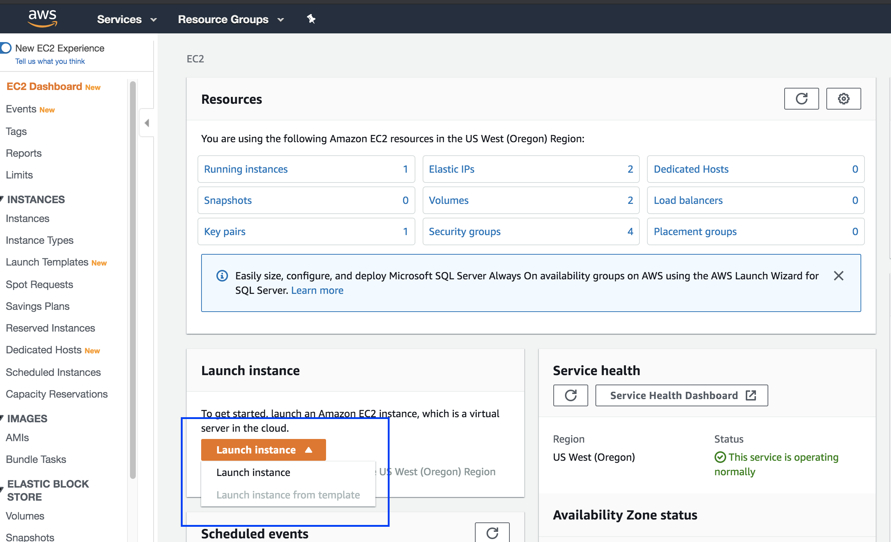
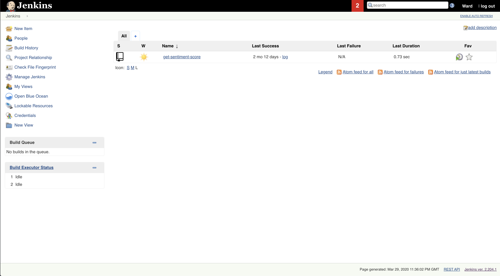
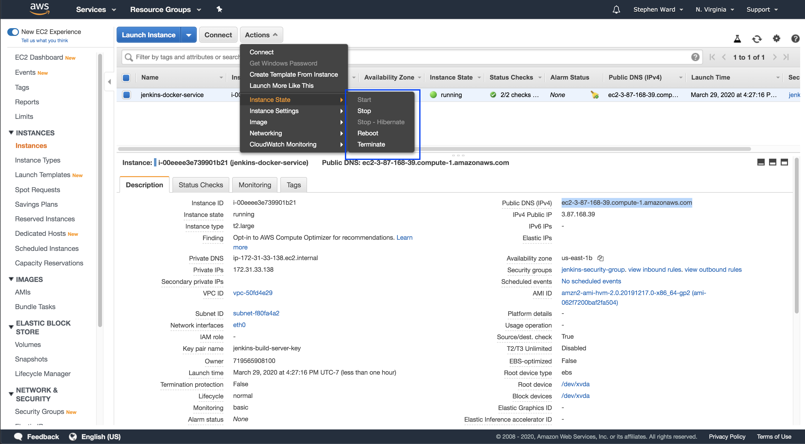

- intro, noting that it's a part two
- start by referring to building from previous article project about sending emails
- terraform/auto lambda creation/update setup piece
- more granular explanations about the jenkins docker pieces

Looks like we're in good shape. Time for the next step: setting up the CI/CD workflow.

### Hooking Into a Build Process

The downside of Jenkins is that it's not a hosted service. Rather, users must install and host the application on their own hardware. Since I already have an AWS account, I decided to use that provider.

For this project, I'm going to run a Jenkins server in a Docker container on an EC2 instance. There are admittedly countless permutations of different stacks and services I could've chosen to host this service. Ultimately, I chose the Docker route because Jenkins provides the images. This seemed easier than writing or following a script that had me install Java, Jenkins, and other utilities from scratch. I also chose an EC2 instance instead of a more integrated service like ECS or EKS for two reasons:

1. I'll only need one build server, so task definitions and services felt like overkill
2. Keeping it on a VPS with Docker installed is easily repeatable across cloud providers (well, I'm using the Amazon Linux AMI for its CLI helpers, but the lock-in is still loose)

Alright, let's dive in.

### Creating the EC2 Instance

First, log onto the AWS Console and navigate to the EC2 dashboard. There, you should be able to launch a new instance.

  

The wizard will walk you through creating a new instance. Below are the details for each section.

- For my AMI I'm selecting the <strong>Amazon Linux 2 AMI (HVM), SSD Volume Type</strong>. If you _really_ don't want vendor lock-in, you could probably use Ubuntu or some other Linux flavor just fine.
- For instance type, select t2.medium size or larger. This is due to Jest crashing earlier attempts at smaller sizes. (yes, even with the `runInBand` flag)
- You should be able to leave the defaults under steps 3-5, accepting defaults for instance config, storage, and tags.
- The security group section is where things get a bit complicated. If you've never set up a security group in AWS before, it's what implements security for your instance at the port and protocol access layer. Seeing as we'd want to reach out to this server over the web, we'll need to have some ports accessible. Specifically, we'll want SSH, HTTP, and port 8080 accessible in the inbound rules. Here's a <a href="https://d1.awsstatic.com/Projects/P5505030/aws-project_Jenkins-build-server.pdf" target="_blank">detailed explanation</a> for the nervous at home.
- On the final page of the wizard, review the details to ensure everything looks correct, then launch the instance!

Cool, we'll be ready to SSH into the server and install Docker after giving the instance a few moments to spin up. Here are the <a href="https://jenkins.io/doc/tutorials/create-a-pipeline-in-blue-ocean/" target="_blank">blessed steps</a> to installing.

If everything works with the install process, you should be able to access the Jenkins server from the address provided and view your connected repository in the dashboard:

  

### Watching the Magic Happen

Now that we have a fully functional CI/CD pipeline, let's update the codebase and watch the process kick off.

- final step would be creating a new implementation

  - implementing actual reading from the filesystem in a final section, pushing and watching the build succeed/lambda update!

### Teardown

If you've followed along and intend to keep your build server running at all times, you can go ahead and skip this section. For the rest of you, here's how to stop and/or terminate an EC2 instance you created and avoid a bill from AWS.

First, navigate back to the EC2 section under the list of services. Then go to the "running instances" section in the sidebar on the left. If you don't see the server, make sure your dashboard is set to the correct region where you provisioned the hardware.

Once on the running instance page, select your instance from the list and select the "Actions" button, which should display a dropdown. All the actions you'll want to take are within the tertiary dropdown on the "Instance State" dropdown option.

  

The two key choices are:

- <strong>Stop</strong>, which will remove the provisioned virtual machine but leave the data stored (<a href="https://aws.amazon.com/ebs/" target="_blank">EBS volume</a>, to be exact), or
- <strong>Terminate</strong>, which permanently removes the virtual machine provisioned and all data associated with it.

Regardless of whichever you choose, both will stop the clock on the usage timer that determines what you owe to AWS.

### Conclusion

With my own personal build server, I can push updates to my apps with greater confidence. My tests ensure I haven't made breaking changes, and the deploy step pushes my revisions live safely and quickly.

Despite all the steps outlined above, there's still more to explore in the maintainability space. To name a few:

- Establishing health checks
- Aggregating logs
- Enabling distributed tracing
- Writing infrastructure as code with tools like Terraform
- A/B testing and replaying traffic

For now, I'm just happy to spend less time in the AWS dashboard :).

If you're interested in learning more, here's the usual list of recommended follow-up resources:

- <a href="https://landing.google.com/sre/sre-book/toc/index.html" target="_blank">Google SRE Book</a>
- <a href="https://www.amazon.com/Accelerate-Software-Performing-Technology-Organizations/dp/1942788339" target="_blank">Accelerate</a> (DevOps book)
- <a href="https://pragprog.com/book/vsjavas/test-driving-javascript-applications" target="_blank">Test-Driving JavaScript Applications</a> (code examples are a bit dated)
- <a href="https://12factor.net/" target="_blank">12-factor app guidelines</a>
- <a href="https://www.terraform.io/" target="_blank">Terraform</a> (infrastructure as code)

As always, thanks for reading.
